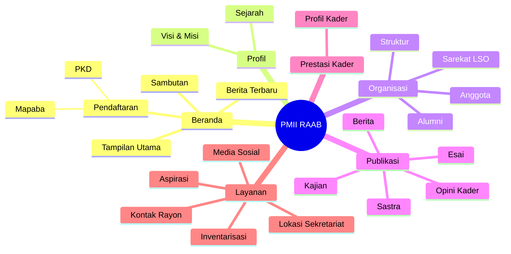

# 01 — Ringkasan Produk

> **Fase 0 — Dokumen Spesifikasi.** Status: *menunggu review*.
> Tanda ⚠️ = asumsi saya, perlu kamu konfirmasi. Tanda ✅ = sudah kamu konfirmasi.

## 1. Identitas Proyek

| Item | Nilai |
|---|---|
| Nama | Website & CMS PMII Rayon Ali Ahmad Baktsir |
| Nama pendek | PMII RAAB |
| Catatan nama | Di permintaan awal tertulis "PMI", di gambar tertulis **PMII** ⚠️ (dipakai: PMII) |
| Komisariat | **PMII Komisariat Raden Mas Said — Cabang Sukoharjo** ✅ |
| Kampus | **UIN Raden Mas Said Surakarta** ✅ |
| Sekretariat | ⚠️ placeholder — diisi lewat Pengaturan Situs |
| Logo | ✅ Tersedia: `logo-pmii-raab.png` (root workspace) → dipindah ke `public/brand/`. **Warna diambil dari logo**: biru `#2E3192`, biru terang `#1B75BB`, kuning `#FFD100`. Versi putih lewat filter CSS; aset lain (favicon, OG image) memakai placeholder |
| Gaya visual | **Neo-brutalism**, kombinasi **biru + kuning**, **mobile-first**, interaktif, **mode gelap** ✅ → lihat `08-desain-visual.md` |
| Jenis produk | Web app organisasi: **situs publik + CMS (panel pengurus) + dashboard anggota** |
| Arsitektur frontend 🆕 | **Halaman publik: Blade + Tailwind** (server-rendered) · **Panel admin & dashboard: Inertia + Vue 3 (TS)** · interaksi halus memakai **Alpine.js** |
| Pengguna | Pengurus, Kader Aktif, Alumni, Publik umum |
| Bahasa | **Bilingual: Indonesia (default) + Inggris** ✅ → lihat `10-lokalisasi-bilingual.md` |
| Hosting | MVP **free tier**, rilis ke hosting murah ✅ → lihat `09-deploy-mvp-free-tier.md` |
| Sumber kebenaran fitur | `NotebookLM Mind Map.png` (sitemap) + hasil diskusi ✅ |

## 2. Tujuan

1. Menjadi **wajah digital** rayon: profil, sejarah, visi-misi, kabar, karya, dan prestasi kader.
2. Menjadi **sistem administrasi internal**: keanggotaan, kepengurusan, inventaris, perpustakaan, keuangan, kegiatan.
3. Menjadi **kanal pendaftaran** Mapaba & PKD yang terkontrol dan tercatat.
4. Menjadi **jembatan alumni**: pendataan, direktori, dan keterlibatan kembali.
5. Menjadi **ruang karya kader**: berita, opini, kajian, esai, sastra.

## 3. Kamus Istilah

| Istilah | Arti yang saya pakai ⚠️ | Mohon dikoreksi bila salah |
|---|---|---|
| **Rayon** | Unit organisasi tingkat paling bawah, berbasis fakultas/Program Studi di dalam Komisariat | |
| **Komisariat** | Unit di atas rayon — **PMII Komisariat Raden Mas Said, Cabang Sukoharjo** ✅ | |
| **Kampus** | **UIN Raden Mas Said Surakarta** ✅ | |
| **RAAB** | Rayon Ali Ahmad Baktsir | |
| **Masa Juang** | Periode kepengurusan, berlaku **1 tahun** ✅ | Dikelola **hanya oleh Superadmin** |
| **Mapaba** | Masa Penerimaan Anggota Baru — pintu masuk anggota | |
| **PKD** | Pelatihan Kader Dasar — pelatihan formal kader | |
| **Mabinra** | Majelis Pembina Rayon — unsur pembina, di atas Ketua Rayon ✅ | |
| **LSO** | Lembaga Semi Otonom — badan otonom di dalam rayon ✅ | 5 unit, masing-masing punya pengurus & halaman |
| **Sarekat** | Label menu untuk kluster LSO ("Sarekat LSO") ⚠️ | Label bisa diganti bila kurang tepat |
| **Biro** | Istilah resmi rayon untuk unit kerja setingkat divisi ✅ | **Bukan** "Divisi" |
| **Advoger** | **Biro** Advokasi dan Gerakan ✅ | Kepala unit disebut **Kepala Biro (Kabiro)** |
| **Biro Gender** | Biro yang menangani isu gender ✅ | Termasuk dalam 8 biro |
| **Mutasi** | LSO seni: musik, teater, aksi, tari ✅ | |
| **Harokatuna** | LSO seni religi: hadrah ✅ | |
| **LDR** | Lembaga Dakwah Rayon ✅ | |
| **LPM Albiruni** | Lembaga Pers Mahasiswa Albiruni (jurnalistik/penerbitan) ⚠️ | Mohon koreksi bila kepanjangannya lain |
| **MJT** | Media Jalan Tengah — publikasi & dokumentasi ✅ | |
| **PUBDOK** | Publikasi & dokumentasi — fungsi yang dijalankan MJT ✅ | |
| **Kader Aktif** | Anggota yang sudah diverifikasi dan berstatus aktif | |
| **Alumni** | Mantan kader yang sudah selesai masa keanggotaan | |
| **Pengurus** | Pemegang role organisasi (Ketua/Sekretaris/Bendahara/Konten Manager) | |
| **Pers Release** | Rilis berita resmi kegiatan untuk publik | |
| **Berita Acara** | Dokumen resmi hasil rapat/kegiatan (notulensi + keputusan) | |
| **Hibah** | Pemberian dana/barang/jasa dari alumni untuk rayon 🆕 | **internal saja** ⚠️ |

## 4. Aktor

| # | Aktor | Ringkas |
|---|---|---|
| 1 | **Publik / Guest** | Membaca situs, kirim aspirasi, daftar Mapaba/PKD, lihat katalog inventaris & perpustakaan, verifikasi kartu kader via QR |
| 2 | **Kader Aktif** | Dashboard pribadi + semua fitur keanggotaan (kartu, presensi, pinjam, sumbang karya/prestasi) |
| 3 | **Alumni** | Dashboard alumni (profil, direktori, mentor, pinjam buku, kontribusi) |
| 4 | **Sekretaris** | Admin: verifikasi anggota, inventaris & perpustakaan, event, berita acara, laporan |
| 5 | **Bendahara** | Admin: keuangan (kas, iuran, anggaran, laporan) — **internal saja** ✅ |
| 6 | **Konten Manager** | Admin: seluruh konten publik (artikel, halaman, hero, media, SEO) |
| 7 | **Superadmin (Ketua)** | Semua modul + kelola user, role, periode, pengaturan situs |

> ⚠️ Asumsi penting ✅: **role organisasi ≠ status keanggotaan**. Pengurus **tidak** otomatis jadi kader aktif; bila ingin akses anggota, ia harus mendaftar anggota aktif.

## 5. Peta Situs Publik (dari mind map)

### Sarekat LSO — 5 Unit ✅

Menu **Sarekat LSO** membuka indeks berisi 5 LSO. **Masing-masing punya pengurus sendiri dan halaman sendiri** ✅:

| LSO | Bidang | Warna khas kartu (usulan) |
|---|---|---|
| **Mutasi** | Seni: musik, teater, aksi, tari | Biru |
| **Harokatuna** | Seni religi: hadrah | Kuning |
| **LDR** (Lembaga Dakwah Rayon) | Dakwah & keagamaan | Toska |
| **LPM Albiruni** | Pers mahasiswa: jurnalistik & penerbitan | Merah bata |
| **MJT** (Media Jalan Tengah) | Publikasi & dokumentasi (pubdok) | Ungu tua |

> Warna khas di atas usulan saya ⚠️ — tujuannya agar tiap LSO mudah dikenali di kartu neo-brutalism.

### Perubahan usulan terhadap sitemap ⚠️

| Perubahan | Alasan | Status |
|---|---|---|
| Tambah menu **Perpustakaan** di bawah Layanan | Buku butuh katalog + pencarian + pinjam, berbeda dari inventaris aset | **perlu disetujui** |
| **Inventarisasi** tetap ada tapi khusus **aset** (non-buku), read-only publik ✅ | Sesuai jawabanmu | ✅ |
| **Pendaftaran** berisi daftar event (Mapaba/PKD) + arsip event lampau | Karena event dibuka/tutup per periode | ✅ |
| **Sarekat LSO** menjadi indeks + **5 halaman LSO** terpisah ✅ | Kelimanya punya pengurus & halaman sendiri | ✅ |
| **Tidak ada** menu publik untuk **Hibah/Dukungan** | Hibah alumni bersifat internal, tanpa pembayaran online | **perlu disetujui** |

### Rincian halaman publik

| Halaman | URL usulan | Isi | Sumber data |
|---|---|---|---|
| Beranda | `/` | Hero/slider, statistik, sambutan singkat, berita terbaru, CTA pendaftaran, prestasi unggulan | `sliders`, `site_settings`, `pages`, `articles`, `achievements` |
| Sambutan | `/sambutan` | Sambutan Ketua + foto + tanda tangan | `pages` |
| Sejarah | `/sejarah` | Naskah sejarah | `pages` |
| Visi & Misi | `/visi-misi` | Naskah visi & misi | `pages` |
| Struktur | `/struktur` (+ `?periode=2025-2026`) | Bagan pengurus per periode | `periods`, `positions`, `position_assignments` |
| Anggota | `/anggota` | Direktori anggota (field publik terbatas) ✅ | `members` |
| Sarekat LSO (indeks) | `/lso` | Daftar 5 LSO: Mutasi, Harokatuna, LDR, LPM Albiruni, MJT | `organisation_units` tipe `lso` |
| Detail LSO | `/lso/{slug}` | Profil LSO, tagline, pengurus, kegiatan, karya/galeri, kontak | `organisation_units` + `position_assignments` |
| Alumni | `/alumni` | Direktori alumni + filter + peta sebaran | `alumni_profiles` |
| Publikasi | `/publikasi` | Gabungan semua tipe + filter | `articles` |
| Berita | `/publikasi/berita` | Tipe `berita` | `articles` |
| Opini Kader | `/publikasi/opini` | Tipe `opini` | `articles` |
| Kajian | `/publikasi/kajian` | Tipe `kajian` | `articles` |
| Esai | `/publikasi/esai` | Tipe `esai` | `articles` |
| Galeri LSO | `/lso/{slug}/galeri` | Album foto per unit ✅ | `galleries`, `gallery_items` |
| Agenda LSO | `/lso/{slug}/agenda` | Agenda publik unit ✅ | `unit_agendas` |
| Sastra | `/publikasi/sastra` | Tipe `sastra` (puisi/cerpen, tampilan khusus) | `articles` |
| Detail artikel | `/publikasi/{tipe}/{slug}` | Isi + penulis + share + artikel terkait | `articles` |
| Prestasi Kader | `/prestasi` | List prestasi + filter tingkat/tahun | `achievements` |
| Profil Kader | `/prestasi/kader/{slug}` | Biodata publik + daftar prestasi + karya | `members`, `achievements`, `articles` |
| Pendaftaran Mapaba | `/pendaftaran/mapaba` | Info + daftar event + form | `events`, `event_registrations` |
| Pendaftaran PKD | `/pendaftaran/pkd` | Idem | idem |
| Kontak Rayon | `/kontak` | Info kontak + form pesan | `messages`, `site_settings` |
| Lokasi Sekretariat | `/lokasi` | Alamat + Google Maps embed + jam operasional | `site_settings` |
| Media Sosial | (footer + `/media-sosial`) | Kumpulan tautan | `social_links` |
| Aspirasi | `/aspirasi` | Form (wajib identitas) + papan aspirasi **tanpa identitas** ✅ | `aspirations` |
| Inventarisasi | `/inventaris` | Katalog aset read-only ✅ | `inventory_items` |
| Perpustakaan | `/perpustakaan` | Katalog buku + pencarian + status ketersediaan ⚠️ baru | `books`, `book_copies` |
| Verifikasi Kader | `/verifikasi-kader/{token}` | Halaman publik validasi kartu kader via QR ✅ | `member_cards` |
| Daftar Akun | `/daftar` | 2 pilihan: Kader Aktif / Alumni ✅ | `member_applications` |
| Masuk | `/masuk` | Login | `users` |

## 6. Peta Panel Admin & Dashboard

| Area | URL prefix | Pemilik |
|---|---|---|
| Panel Pengurus | `/admin` | Superadmin, Sekretaris, Bendahara, Konten Manager |
| Dashboard Kader | `/saya` | Kader Aktif |
| Dashboard Alumni | `/alumni-saya` | Alumni |

Menu panel admin per role:

| Menu | Superadmin | Sekretaris | Bendahara | Konten Manager |
|---|---|---|---|---|
| Dasbor & Statistik | ✅ | ✅ | ✅ | ✅ |
| Verifikasi Pendaftaran | ✅ | ✅ | – | – |
| Keanggotaan (Kader & Alumni) | ✅ | ✅ | – | – |
| Kepengurusan (Periode, Jabatan, LSO) | ✅ | ✅ | – | – |
| Prestasi Kader (verifikasi) | ✅ | ✅ | – | ✅ |
| Publikasi (Artikel & Kategori) | ✅ | ✅ (berita acara/pers release) | – | ✅ |
| Halaman Statis, Hero, Media, SEO | ✅ | – | – | ✅ |
| Event Mapaba/PKD & Peserta | ✅ | ✅ | – | – |
| Kegiatan & Presensi | ✅ | ✅ | – | – |
| Inventaris Aset | ✅ | ✅ | – | – |
| Perpustakaan (Buku, Eksemplar, Peminjaman) | ✅ | ✅ | – | – |
| Peminjaman (persetujuan & serah terima) | ✅ | ✅ | – | – |
| Keuangan | ✅ | – | ✅ | – |
| Iuran Anggota | ✅ | – | ✅ | – |
| Hibah & Dukungan Alumni 🆕 | ✅ | – | ✅ | – |
| Berita Acara & Pers Release | ✅ | ✅ | – | ✅ |
| Pengumuman & Arsip Internal | ✅ | ✅ | – | ✅ |
| Aspirasi | ✅ | ✅ | – | – |
| Laporan & Export | ✅ | ✅ | ✅ | – |
| Pengguna, Role & Pengaturan | ✅ | – | – | – |
| Log Aktivitas | ✅ | – | – | – |

> ⚠️ **Perlu diputuskan:** Berita Acara disediakan untuk Sekretaris **dan** Konten Manager, atau Sekretaris saja? Untuk sekarang Konten Manager **tidak** punya hak publish berita acara.

## 7. Ruang Lingkup

### Termasuk ✅
- Situs publik sesuai sitemap di atas
- CMS multi-role (7 aktor)
- Keanggotaan + verifikasi bertingkat
- Pendaftaran event Mapaba/PKD (tanpa pembayaran) ✅
- Publikasi 5 tipe + berita acara ✅
- Organisasi multi-periode ✅
- Inventaris aset (manajemen penuh) + perpustakaan (pinjam, perpanjang, reservasi) ✅
- Keuangan internal ✅
- Presensi + poin kontribusi, kartu kader + QR, prestasi, aspirasi, pengumuman/arsip
- **Hibah & dukungan alumni** (dana / barang / jasa) — internal, tanpa pembayaran online 🆕
- Export Excel/CSV + PDF (kartu, laporan, berita acara)
- **Mode gelap** (Terang / Gelap / Ikut sistem) ✅
- **Bilingual Indonesia–Inggris** untuk seluruh halaman publik; panel admin tetap Indonesia ✅
- **Terjemahan otomatis konten** — isi sekali dalam bahasa Indonesia, versi Inggris dibuat mesin lalu boleh disunting ✅
- **Galeri & agenda unit/LSO** yang dikelola Konten Manager ✅
- **Iuran berkategori**: anggota aktif, pengurus, alumni — diatur Bendahara ✅
- SEO dasar (meta, Open Graph, `sitemap.xml` per bahasa, `hreflang`)

### Tidak termasuk (untuk saat ini)
| Item | Alasan |
|---|---|
| Payment gateway / pembayaran online | ✅ Tidak diminta; keuangan & hibah hanya pencatatan, transfer dilakukan di luar sistem |
| Bahasa Arab / RTL | Di luar lingkup — hanya ID & EN ✅ |
| SSR Inertia | Hosting murah ✅ |
| Aplikasi mobile native | Cukup responsive web |
| Chat/forum realtime | Belum diperlukan |
| Video conference terintegrasi | Cukup tautan |
| PWA/offline mode | Belum diperlukan ⚠️ |
| Komentar pengunjung di artikel | Belum diputuskan ⚠️ (usulan: belum) |
| RSS/feed | Belum diputuskan ⚠️ (murah, usul: ya) |
| Auto-posting ke media sosial | Bisa menyusul di luar fase 0–9 |

## 8. Prinsip Desain

1. **Satu aplikasi, tiga pengalaman** — publik, panel pengurus, dashboard anggota; satu codebase Laravel + Inertia.
2. **Hak akses eksplisit** — setiap aksi punya permission; tidak ada "karena admin jadi boleh semua" kecuali Superadmin.
3. **Semua yang resmi tercatat** — verifikasi, pinjam-kembali, transaksi kas, publikasi: punya pelaku + waktu + jejak (`activity_log`).
4. **Kader tidak boleh kehilangan jejak** — riwayat keanggotaan, jabatan, presensi, prestasi, dan karya menempel pada satu profil.
5. **Ramah hosting murah** — tanpa Node di server, tanpa Redis, queue & scheduler via cron, gambar dioptimalkan di server.
6. **Data publik dibatasi** — NIM, email, nomor HP, dan data sensitif **tidak** pernah tampil di halaman publik.
7. **Bahasa antarmuka konsisten** — istilah organisasi memakai istilah PMII (Mapaba, PKD, LSO), bukan padanan generik.
8. **Semua form publik terlindungi** — rate limit, honeypot, dan captcha ringan.
9. **Tampilan neo-brutalism, mobile-first, interaktif** — garis tebal, bayangan keras, palet biru-kuning; dirancang mulai dari layar 360px. Detail di `08-desain-visual.md`.
10. **Tidak ada teks/angka kosong di halaman publik** — semua identitas situs diambil dari Pengaturan Situs dengan placeholder yang jelas.
11. **Dua bahasa, satu pengalaman** — semua teks antarmuka lewat sistem terjemahan; Indonesia wajib, Inggris opsional dengan fallback yang jelas.
12. **Ringan & hemat kuota** — dirancang untuk jaringan lambat; animasi halus, gambar teroptimasi, tanpa pustaka berat.
13. **Halaman publik wajib jalan tanpa JavaScript** — dirender server-side (Blade); JavaScript hanya memperhalus, bukan untuk menampilkan konten.

## 9. Definisi Selesai (Definition of Done)

Sebuah fase dianggap selesai bila:

- [ ] Semua modul di fase itu bisa dipakai dari UI (bukan hanya backend)
- [ ] Hak akses diuji: setiap role hanya bisa mengakses yang seharusnya
- [ ] Validasi form server-side + pesan error berbahasa Indonesia
- [ ] Responsive (mobile 360px, tablet, desktop)
- [ ] Data penting tercatat di `activity_log`
- [ ] Ada minimal **1 feature test** per alur kritis
- [ ] Sudah diuji manual olehmu dan disetujui
- [ ] `npm run build` sukses dan siap di-upload ke hosting

## 10. Baca Selanjutnya

- `02-role-permission.md` — detail role & matriks hak akses
- `03-alur-bisnis.md` — 12 alur kerja lengkap
- `04-data-model.md` — ERD & struktur database
- `05-roadmap-fase.md` — rencana pembangunan Fase 1–9
- `06-teknis-hosting.md` — keputusan teknis & batasan hosting
- `07-asumsi-terbuka.md` — **paling penting: asumsi saya & hal yang perlu kamu jawab**
