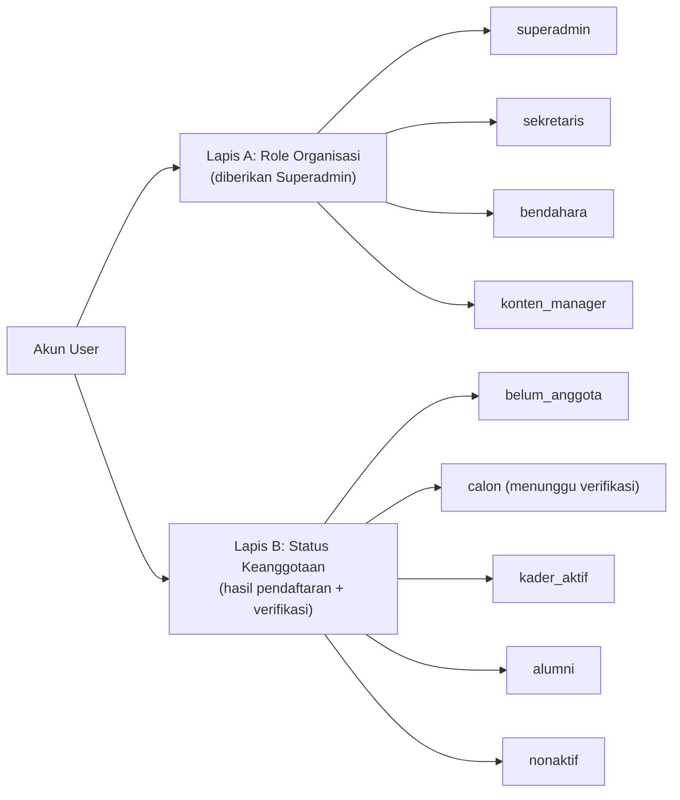
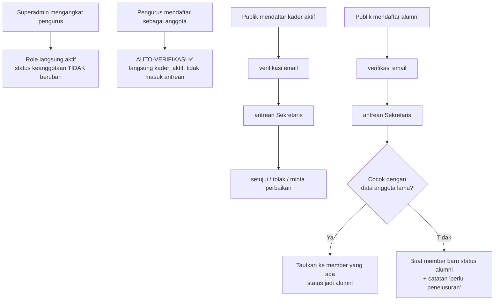

# 02 — Role & Hak Akses

> **Fase 0 — Dokumen Spesifikasi.** Status: *menunggu review*. ⚠️ = asumsi, ✅ = sudah dikonfirmasi.

## 1. Model Dua Lapis (keputusan pentingmu ✅)

Ada **dua hal berbeda** yang sering tertukar: *role organisasi* (jabatan struktural) dan *status keanggotaan* (keanggotaan rayon). Kamu memutuskan keduanya **terpisah**: pengurus tidak otomatis menjadi anggota.



### Konsekuensi yang harus dipahami

| Situasi | Yang terjadi |
|---|---|
| Role Sekretaris, status keanggotaan `belum_anggota` | Hanya bisa masuk **Panel Pengurus**. Tidak punya kartu kader, tidak bisa presensi, tidak bisa pinjam buku/aset, tidak terdaftar di direktori Anggota. |
| Role Sekretaris + status `kader_aktif` | Dua pintu: **Panel Pengurus** dan **Dashboard Saya**. |
| Kader aktif tanpa role | Hanya **Dashboard Saya**. |
| Alumni tanpa role | Hanya **Dashboard Alumni**. |
| Tamu | Situs publik + form aspirasi + daftar event. |

> 🎯 **Prinsip teknis:** akses ke fitur keanggotaan **tidak** ditentukan role, melainkan keberadaan `members.status_keanggotaan`. Fitur panel admin **hanya** ditentukan role.

## 2. Daftar Role

| Kode | Label | Cara didapat | Jumlah pemegang |
|---|---|---|---|
| `superadmin` | Ketua Pengurus / Administrator | Diberikan Superadmin lain saat inisialisasi | 1–2 orang |
| `sekretaris` | Sekretaris | Diangkat Superadmin | 1 orang (+1 wakil opsional) |
| `bendahara` | Bendahara | Diangkat Superadmin | 1 orang |
| `konten_manager` | Konten Manager | Diangkat Superadmin | 1–3 orang |

Role keanggotaan (`kader_aktif`, `alumni`) **tidak** dibuat sebagai Spatie role, melainkan sebagai **status** pada tabel `members`, agar tidak tumpang tindih dengan role jabatan. ⚠️ *Alternatif:* tetap dipasang sebagai Spatie role untuk memudahkan `@can`. **Usulan saya: status di `members` saja**, dan buat Gate khusus `is-member`.

## 3. Konvensi Penamaan Permission

Format: `modul.aksi` (contoh: `articles.publish`, `loans.approve`). Dikelompokkan per modul, ditulis dalam bahasa Inggris konsisten agar mudah di-`@can`.

## 4. Katalog Permission

### Dasbor
```
dashboard.view
dashboard.view-finance-summary
dashboard.view-membership-summary
```

### Pengguna & Akses (khusus Superadmin)
```
users.view            users.create          users.update         users.delete
users.suspend         users.assign-role     users.reset-password
roles.view            activity-log.view     settings.manage
periods.view          periods.create        periods.update       periods.delete        periods.activate
```

### Keanggotaan
```
members.view          members.verify        members.update       members.export
members.change-status members.view-sensitive (NIM/HP/email)     members.delete
verifications.view    verifications.approve verifications.reject verifications.request-revision
member-cards.issue    member-cards.revoke
alumni-profiles.view  alumni-profiles.update alumni-profiles.verify  alumni-profiles.export
```

### Organisasi
```
units.view            units.create          units.update         units.delete
positions.view        positions.manage      assignments.manage
```

### Publikasi
```
articles.view         articles.create       articles.update      articles.delete
articles.review       articles.publish      articles.publish-berita-acara
articles.feature      articles.schedule     article-categories.manage   tags.manage
```

### Halaman & Tampilan Situs
```
pages.manage          sliders.manage        social-links.manage   settings.site-manage
contacts.view         contacts.reply        messages.view        messages.reply
```

### Media
```
media.view            media.upload          media.update         media.delete
```

### Event (Mapaba / PKD)
```
events.view           events.create         events.update        events.delete
events.open-close     registrations.view    registrations.verify registrations.reject
registrations.export  registrations.mark-attendance  events.promote-to-member
```

### Kegiatan & Presensi
```
activities.view       activities.manage     attendances.view     attendances.manage
attendances.open-qr   points.view           points.adjust
```

### Prestasi
```
achievements.view     achievements.verify   achievements.reject achievements.feature
achievements.delete   achievement-categories.manage
```

### Pengumuman & Arsip
```
announcements.view    announcements.manage  documents.view       documents.manage
galleries.manage      unit-agendas.manage   translations.manage
```

### Inventaris Aset
```
inventory.categories.manage   inventory.items.view    inventory.items.manage
inventory.movements.manage    inventory.export
```

### Perpustakaan
```
library.books.view    library.books.manage  library.copies.manage
library.reservations.view   library.reservations.manage
```

### Peminjaman
```
loans.view            loans.request-own     loans.request-for-others
loans.approve         loans.reject          loans.handover       loans.receive-return
loans.extend-approve  loans.manage          loans.report-damage
```

### Keuangan (internal ✅)
```
finance.accounts.manage   finance.categories.manage  finance.transactions.view
finance.transactions.manage  finance.transactions.verify  finance.void
dues.manage           dues.payments.verify  dues.payments.manage
budgets.manage        finance.reports.view  finance.export
donations.view        donations.verify      donations.manage      donations.export
```

### Aspirasi
```
aspirations.view      aspirations.reply     aspirations.publish  aspirations.close
aspirations.view-identity
```

### Laporan
```
reports.generate      reports.export
```

## 5. Matriks Role × Permission

Legenda: ✅ penuh · 🟡 terbatas (lihat catatan) · – tidak ada

### A. Panel & Administrasi

| Permission | Superadmin | Sekretaris | Bendahara | Konten Manager |
|---|---|---|---|---|
| `dashboard.view` | ✅ | ✅ | ✅ | ✅ |
| `users.*`, `roles.view`, `settings.manage` | ✅ | – | – | – |
| `periods.*` | ✅ | ✅ | – | – |
| `activity-log.view` | ✅ | – | – | – |
| `members.view` | ✅ | ✅ | 🟡 | – |
| `members.view-sensitive` | ✅ | ✅ | 🟡 | – |
| `verifications.*` | ✅ | ✅ | – | – |
| `members.change-status`, `member-cards.*` | ✅ | ✅ | – | – |
| `alumni-profiles.view/update/export` | ✅ | ✅ | – | – |
| `units.*`, `positions.*`, `assignments.manage` | ✅ | ✅ | – | – |
| `articles.*` | ✅ | 🟡 (hanya `berita_acara` + `pers_release`) | – | ✅ |
| `pages.manage`, `sliders.manage`, `settings.site-manage`, `social-links.manage` | ✅ | – | – | ✅ |
| `media.*` | ✅ | 🟡 (unggah bukti/poster) | 🟡 (unggah bukti transaksi) | ✅ |
| `events.*`, `registrations.*` | ✅ | ✅ | – | – |
| `activities.*`, `attendances.*` | ✅ | ✅ | – | – |
| `achievements.verify/feature` | ✅ | ✅ | – | ✅ |
| `announcements.manage`, `documents.manage` | ✅ | ✅ | 🟡 (dokumen keuangan) | ✅ |
| `galleries.manage`, `unit-agendas.manage`, `translations.manage` 🆕 | ✅ | – | – | ✅ |
| `inventory.*` | ✅ | ✅ | – | – |
| `library.*` | ✅ | ✅ | – | – |
| `loans.approve/handover/receive-return` | ✅ | ✅ | – | – |
| `finance.*`, `dues.*`, `budgets.*`, `donations.verify` 🆕 | ✅ | – | ✅ | – |
| `aspirations.view/reply/publish/close` | ✅ | ✅ | – | – |
| `reports.generate/export` | ✅ | ✅ | ✅ (keuangan) | – |

Catatan 🟡:
- Bendahara hanya melihat data anggota **yang relevan dengan uang**: nama, nomor anggota, status iuran. Tidak boleh melihat NIM/alamat/dokumen.
- Sekretaris `media.*` terbatas untuk kebutuhan dokumen (poster event, bukti, lampiran berita acara), bukan mengelola seluruh media library.
- Sekretaris tidak boleh mengubah artikel tipe `berita`/`opini`/`kajian`/`esai`/`sastra` — itu milik Konten Manager. Sekretaris hanya `berita_acara` & `pers_release`.

### B. Kader Aktif (berbasis kepemilikan / `own`)

| Permission | Kader Aktif | Alumni |
|---|---|---|
| `profile.view-own`, `profile.update-own` | ✅ | ✅ (data alumni) |
| `member-cards.view-own` | ✅ | – |
| `attendances.view-own` | ✅ | – |
| `points.view-own` | ✅ | – |
| `articles.create` (submisi) | ✅ | ✅ ⚠️ |
| `achievements.submit-own` | ✅ | ✅ |
| `loans.request-own` (aset & buku) | ✅ ✅ | ✅ ✅ |
| `library.reservations.create-own` | ✅ | ✅ |
| `dues.view-own` | ✅ | ✅ (kategori: iuran alumni) ✅ |
| `announcements.view-internal` | ✅ | ✅ (versi alumni) |
| `documents.view-member` | ✅ | 🟡 |
| `alumni-directory.view` | ✅ | ✅ |
| `mentorship.opt-in` | – | ✅ |
| `donations.offer-own` (hibah dana/barang/jasa) 🆕 | – | ✅ |
| `aspirations.create` | ✅ | ✅ (juga publik) |

Catatan:
- ⚠️ **Apakah alumni boleh mengirim tulisan (Opini Kader)?** Label tipe adalah "Opini **Kader**". Usulan saya: **boleh**, tapi diberi label "Alumni" di samping namanya. Perlu konfirmasi.
- ✅ Iuran alumni: **tidak wajib**. Sebagai gantinya alumni bisa memberi **hibah** (dana/barang/jasa) dari dashboard → dicatat & diverifikasi Bendahara 🆕
- Semua permission `*-own` diimplementasikan lewat **Policy** (contoh: `ArticlePolicy::update` memeriksa `author_id === user->id`), bukan lewat role.

### C. Publik (tanpa login)

| Aksi | Boleh? | Perlindungan |
|---|---|---|
| Baca semua halaman publik | ✅ | – |
| Kirim aspirasi (wajib identitas) | ✅ | rate limit + honeypot + captcha |
| Daftar event Mapaba/PKD | ✅ | rate limit + honeypot + captcha |
| Lihat katalog inventaris & perpustakaan | ✅ | – |
| Verifikasi kartu kader via QR/token | ✅ | hanya field aman |
| Kirim pesan kontak | ✅ | rate limit |
| Daftar akun (kader/alumni) | ✅ | verifikasi email + verifikasi Sekretaris |
| Lihat direktori anggota/alumni penuh | ❌ | perlu login |

## 6. Aturan Pemberian Role & Verifikasi



| Aturan | Detail |
|---|---|
| Hanya Superadmin menetapkan role | Termasuk mencabut role |
| Hanya Superadmin mengelola **periode kepengurusan** 🆕 | Membuat, mengaktifkan, dan menutup masa juang; Sekretaris hanya melihat |
| Pengurus auto-verifikasi ✅ | Jika pemegang role mana pun mendaftar anggota, status langsung `kader_aktif` — **kecuali** klaim alumni ⚠️ (usulan: tetap diverifikasi Sekretaris/Superadmin karena butuh penelusuran data) |
| Tidak boleh self-approve | Pendaftaran anggota oleh pemegang role `sekretaris` tidak boleh disetujui oleh dirinya sendiri; diproses Superadmin |
| Minimal 1 Superadmin | Superadmin terakhir tidak boleh dihapus/dicabut |
| Pencabutan tidak menghapus data | Role dicabut → riwayat jabatan, presensi, prestasi, karya tetap tersimpan |
| Perubahan status keanggotaan dicatat | `member_status_histories`: dari, ke, alasan, oleh, kapan |
| Sekretaris tidak bisa mengangkat Sekretaris | Hanya Superadmin |

## 7. Perbedaan Ringkas: Kader Aktif vs Alumni

| Aspek | Kader Aktif | Alumni |
|---|---|---|
| Presensi kegiatan | ✅ | Opsional (undangan) |
| Poin kontribusi | ✅ | ⚠️ usulan: tidak dihitung |
| Kartu kader + QR | ✅ | ❌ (kartu alumni terpisah? ⚠️) |
| Pinjam buku | ✅ | ✅ ✅ |
| Pinjam aset (tenda/sound/alat) | ✅ | ✅ ✅ |
| Iuran | ✅ (bila berlaku) | ⚠️ sukarela |
| Kirim karya | ✅ | ⚠️ perlu konfirmasi |
| Klaim prestasi | ✅ | ✅ |
| Direktori alumni | ✅ (baca) | ✅ (baca + tulis profil sendiri) |
| Profil publik di halaman Anggota | ✅ | ❌ (pindah ke halaman Alumni) |
| Jabatan di struktur | ✅ (sesuai periode) | ❌ (hanya riwayat lampau) |
| Peminjaman atas nama orang luar | ❌ | ❌ (hanya Sekretaris) ✅ |
| Edit data profil sendiri | ✅ | ✅ (sebagian perlu verifikasi) |

## 8. Strategi Teknis Hak Akses

| Kebutuhan | Implementasi |
|---|---|
| Role & permission | `spatie/laravel-permission` |
| Cek akses keanggotaan | Gate `is-member` (custom) membaca `members.status_keanggotaan` |
| Kepemilikan data (`own`) | Laravel **Policy** per model |
| Filter daftar di CMS | Global scope / query filter berdasarkan role |
| Proteksi route | Middleware `role:*` + `permission:*` + `member` |
| Sembunyikan menu di UI | `usePage().props.auth.can` (share permission dari server) |
| Field sensitif | **API Resource** terpisah: `MemberPublicResource` vs `MemberAdminResource` |
| Jejak audit | `spatie/laravel-activitylog` pada model kritis (members, awards, loans, transactions, articles, events) |
| 2FA (TOTP) | **Opsional untuk semua pengurus** ✅ — dapat dinyalakan per akun, tidak diwajibkan |
| Guard | Satu guard `web`; pembedaan area lewat prefix + middleware (lebih ringkas daripada multi-guard) |

> Catatan keamanan: `can` di frontend **hanya** untuk menyembunyikan UI. Setiap aksi tetap diverifikasi di server lewat middleware/Policy. Ini wajib dan akan diuji di setiap fase.
