# 03 — Alur Bisnis

> **Fase 0 — Dokumen Spesifikasi.** Status: *menunggu review*. ⚠️ = asumsi, ✅ = sudah dikonfirmasi.

Daftar alur:
1. Registrasi & verifikasi akun anggota
2. Naik status Kader Aktif → Alumni
3. Pendaftaran event Mapaba & PKD
4. Submisi & publikasi karya kader
5. Berita Acara & Pers Release
6. Verifikasi prestasi kader
7. Peminjaman aset (internal & pihak luar)
8. Perpustakaan: pinjam, perpanjang, reservasi
9. Presensi kegiatan & poin kontribusi
10. Iuran & pembayaran
11. Aspirasi
12. Kartu kader & verifikasi QR
13. Pencatatan kas & laporan keuangan
14. Hibah & dukungan alumni 🆕

---

## Alur 1 — Registrasi & Verifikasi Akun Anggota ✅

**Aktor:** Publik (pendaftar), Sistem (email), Sekretaris/Superadmin (verifikator)

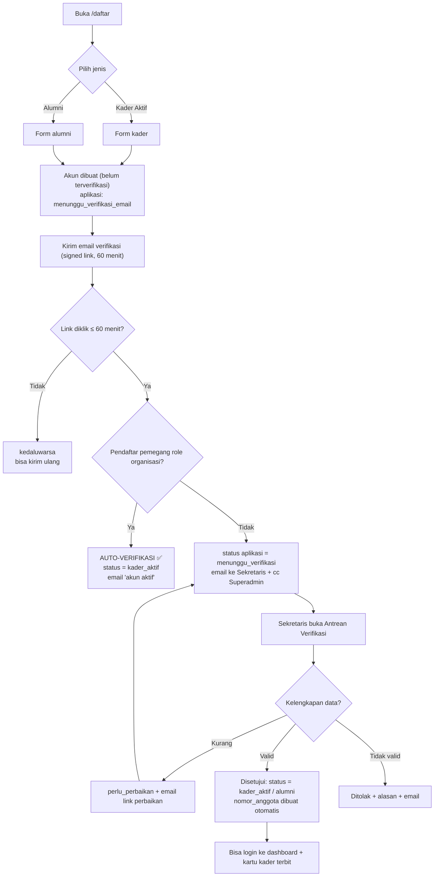

**Aturan & validasi**
- 1 email = 1 akun. Email harus unik dan belum pernah dipakai.
- NIM wajib untuk kader aktif; divalidasi unik.
- Untuk alumni: wajib isi angkatan (tahun Mapaba) + tahun selesai mandat → sistem **mencari kecocokan** dengan `members` lama (nama + angkatan). Bila cocok → ditautkan; bila tidak → dibuat record baru dengan catatan "perlu penelusuran". ✅
- Nomor anggota otomatis, format: `RAAB-{tahun}-{urut 3 digit}` ⚠️ (perlu persetujuan format).
- Sekretaris **tidak boleh** memverifikasi pendaftaran dirinya sendiri ✅ (diproses Superadmin).
- Semua keputusan tercatat: `member_applications` + `member_status_histories` + `activity_log`.
- Alasan penolakan wajib diisi (min. 20 karakter) agar pendaftar paham.

**Notifikasi email (via Brevo/Resend ✅)**

| Pemicu | Penerima | Isi |
|---|---|---|
| Pendaftaran dibuat | Pendaftar | Link verifikasi email |
| Email terverifikasi | Sekretaris + Superadmin | Ada pendaftar baru menunggu verifikasi |
| Diverifikasi | Pendaftar | Akun aktif + nomor anggota + tombol masuk |
| Ditolak | Pendaftar | Alasan + opsi ajukan ulang |
| Perlu perbaikan | Pendaftar | Daftar data yang harus dilengkapi |
| Diterima jadi alumni | Pendaftar | Status alumni + ajakan lengkapi profil |

---

## Alur 2 — Naik Status Kader Aktif → Alumni

**Aktor:** Superadmin/Sekretaris

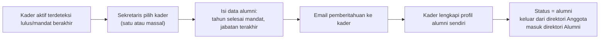

**Aturan**
- Perubahan status **tidak** menghapus: jabatan, presensi, prestasi, karya, riwayat pinjam tetap tersimpan.
- Kader yang pindah status ke alumni otomatis kehilangan akses: kartu kader, presensi, poin kontribusi, iuran.
- Alumni tetap bisa: pinjam buku & aset ✅, kirim aspirasi, lihat direktori alumni, tawarkan diri jadi mentor.
- Bisa dibatalkan (revert ke kader aktif) bila salah, dengan alasan tercatat.

---

## Alur 3 — Pendaftaran Event Mapaba & PKD ✅

**Aktor:** Sekretaris (pengelola), Publik (pendaftar)

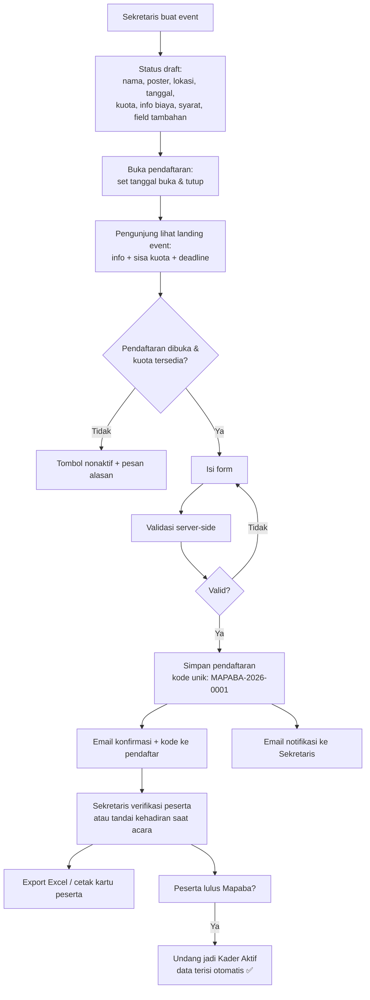

**Aturan**
- Pendaftar **tidak perlu punya akun** ✅. Form diisi sebagai tamu.
- Kuota: bila `jumlah_pendaftaran_terverifikasi ≥ kuota`, pendaftaran ditutup otomatis. ⚠️ Usulan: sisa kuota dihitung dari pendaftaran berstatus `menunggu` + `terverifikasi`.
- Event bisa ditutup manual kapan saja oleh Sekretaris (status `ditutup`).
- Field tambahan fleksibel per event (mis. ukuran kaos, alergi makanan) disimpan di `events.field_tambahan` (JSON) dan jawabannya di `event_registrations.data_tambahan` (JSON).
- **Tanpa pembayaran** ✅. Info biaya hanya teks (mis. "Kontribusi Rp50.000 dibayar di lokasi").
- Email konfirmasi wajib berisi: nama event, tanggal, lokasi (link maps), kode pendaftaran, narahubung.
- Arsip: setelah selesai, event tetap bisa dilihat publik di daftar event lampau (`/pendaftaran/mapaba`).

**Field form standar (usulan ⚠️)**

| Field | Wajib | Catatan |
|---|---|---|
| Nama lengkap | ✅ | |
| Jenis kelamin | ✅ | L/P |
| NIM | ✅ | |
| Email | ✅ | untuk konfirmasi |
| No. HP / WhatsApp | ✅ | |
| Fakultas & Program Studi | ✅ | |
| Angkatan kuliah | ✅ | |
| Tempat & tanggal lahir | ⚠️ | usulan: ya (kebutuhan data keanggotaan) |
| Alamat domisili | ⚠️ | usulan: ya (kota saja) |
| Asal sekolah | ⚠️ | usulan: tidak |
| Asal komisariat/kampus | ⚠️ | usulan: ya, untuk peserta luar |
| Motivasi mengikuti | ⚠️ | usulan: ya, 1 paragraf |
| Ukuran kaos | ⚠️ | usulan: ya |
| Catatan kesehatan | ⚠️ | usulan: ya |

---

## Alur 4 — Submisi & Publikasi Karya Kader ✅

**Aktor:** Kader/Alumni (penulis), Konten Manager (editor), Sekretaris (jalur khusus)

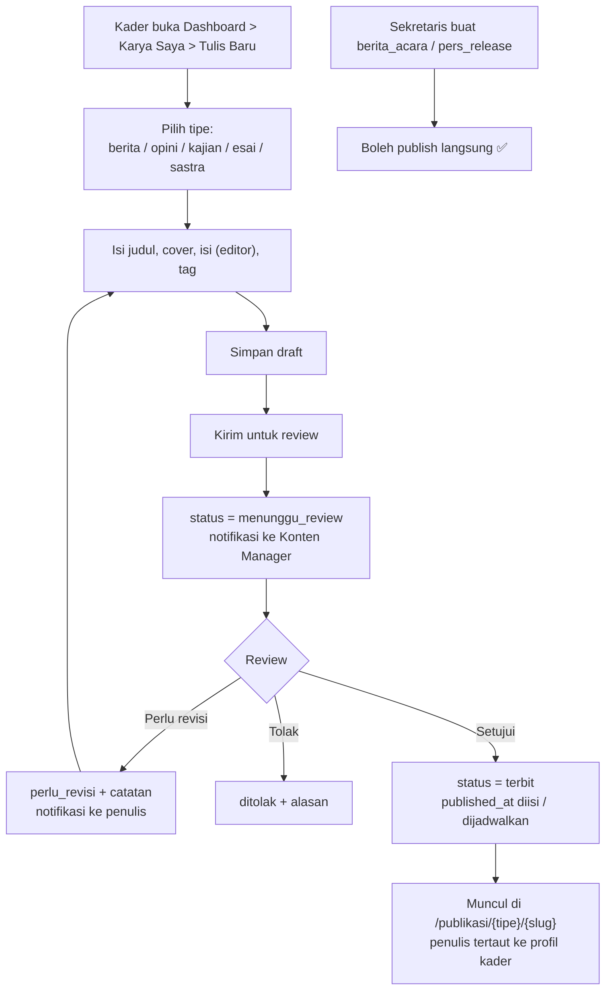

**Aturan**
- Hanya 5 tipe di atas (+ 2 tipe khusus Sekretaris) ✅.
- Penulis **tidak** boleh menerbitkan sendiri; wajib lewat review. Kecuali Sekretaris untuk `berita_acara`/`pers_release` ✅.
- Sastra (puisi/cerpen): tampilan halaman beda — tipografi lebih lega, tanpa kolom sidebar ⚠️ (bisa juga sama seperti tipe lain; usulan: layout khusus).
- Artikel bisa **dijadwalkan** (`published_at` di masa depan) — pemrosesan via cron `schedule:run`.
- Setiap perubahan setelah terbit disimpan di `article_revisions` (min. 10 revisi terakhir).
- Penulis hanya bisa mengedit karyanya sendiri, dan **hanya saat** `draft` atau `perlu_revisi` (setelah terbit, harus lewat Konten Manager).
- Slug otomatis dari judul, harus unik; bisa diubah manual oleh Konten Manager.

---

## Alur 5 — Berita Acara & Pers Release ✅

**Aktor:** Sekretaris

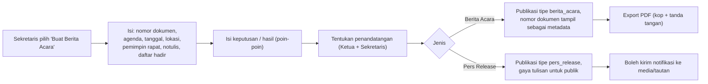

**Aturan**
- **Bukan** modul surat-menyurat penuh (tanpa surat masuk/keluar) ✅.
- Nomor dokumen: `{urut}/BA/RAAB/{bulan romawi}/{tahun}` ⚠️ (perlu persetujuan format).
- Nomor dokumen harus unik; sistem mengusulkan nomor berikutnya otomatis.
- Daftar hadir bisa diambil dari `attendances` kegiatan terkait (opsional) atau diketik manual.
- Export PDF memakai kop surat (logo + nama rayon + alamat). ⚠️ Perlu file kop resmi.

---

## Alur 6 — Verifikasi Prestasi Kader ✅

**Aktor:** Kader/Alumni (pengaju), Sekretaris/Konten Manager (verifikator)

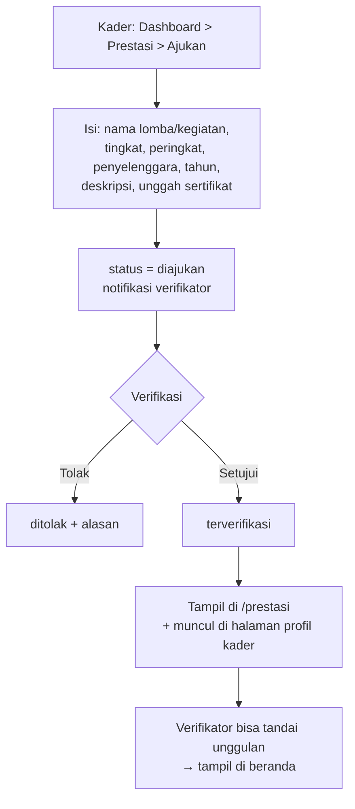

**Aturan**
- Tingkat prestasi: `rayon`, `komisariat`, `kota`, `provinsi`, `nasional`, `internasional` ⚠️ (perlu konfirmasi daftar).
- Sekretaris/Konten Manager juga bisa **input prestasi manual** untuk kader (mis. data lama).
- Prestasi yang sudah terverifikasi tidak bisa dihapus, hanya dinonaktifkan.
- Satu kader bisa punya banyak prestasi; halaman profil kader menampilkan urut tahun terbaru.

---

## Alur 7 — Peminjaman Aset (internal & pihak luar) ✅

**Aktor:** Kader/Alumni (peminjam internal), Sekretaris (pengelola & pencatat pinjaman eksternal)

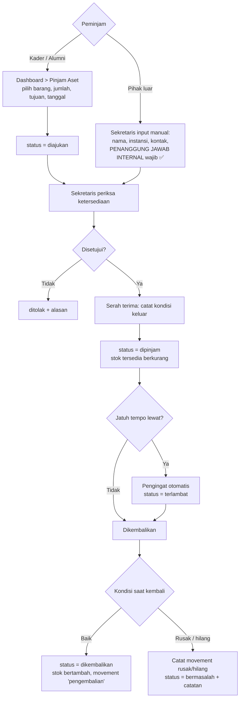

**Aturan**
- Peminjam internal: Kader Aktif + Alumni ✅.
- Peminjam eksternal: **hanya Sekretaris** yang boleh mencatat ✅, dan **wajib** mencantumkan penanggung jawab internal (kader/pengurus yang bertanggung jawab).
- Pengajuan internal boleh disetujui otomatis **atau** manual — saya usulkan **manual** (melibatkan barang fisik), dan bisa diubah per barang di CMS ⚠️.
- Barang dengan `is_loanable = false` (mis. inventaris penting) tidak bisa diajukan.
- Jumlah pinjam tidak boleh melebihi `jumlah_tersedia`.
- Pengingat email H-1 jatuh tempo + saat terlambat (harian, via cron).
- **Tanpa denda** ✅ untuk semua peminjaman (termasuk buku).
- Bila rusak/hilang → tercatat sebagai `inventory_movements` tipe `rusak`/`hilang` + catatan siapa yang bertanggung jawab.

---

## Alur 8 — Perpustakaan: Pinjam, Perpanjang, Reservasi ✅

**Aktor:** Kader/Alumni (peminjam), Sekretaris (pengelola)

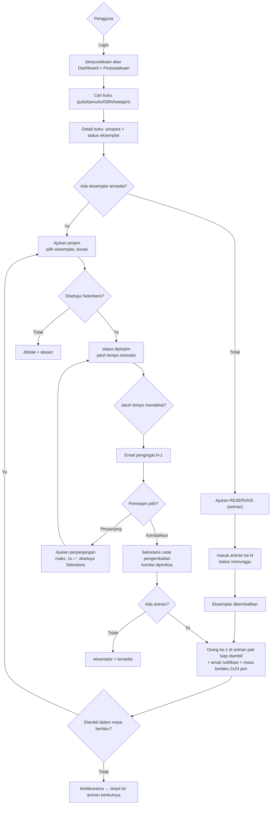

**Parameter awal (usulan, bisa diubah lewat CMS ⚠️)**

| Parameter | Usulan default | Configurable? |
|---|---|---|
| Masa pinjam | 7 hari | ✅ |
| Perpanjangan | Maks. 1x, masing-masing 7 hari ✅ | ✅ |
| Jumlah buku per peminjam | 2 buku | ✅ |
| Masa berlaku "siap diambil" | 2×24 jam | ✅ |
| Reservasi/antrian | ✅ Ada | – |
| Denda | ❌ Tidak ada ✅ | – |
| Perpanjangan otomatis | ❌ Tidak (perlu persetujuan) | ✅ |
| Pemberi persetujuan pinjam | Sekretaris | ⚠️ bisa juga auto untuk buku |

**Aturan tambahan**
- Hanya kader aktif & alumni yang boleh meminjam ✅ (publik hanya melihat katalog).
- Bila eksemplar rusak/hilang, peminjam bertanggung jawab; status eksemplar diubah + catatan.
- Riwayat pinjam tampil di dashboard peminjam ("Sedang dipinjam", "Riwayat").

---

## Alur 9 — Presensi Kegiatan & Poin Kontribusi

**Aktor:** Sekretaris (pembuat kegiatan), Kader (peserta)

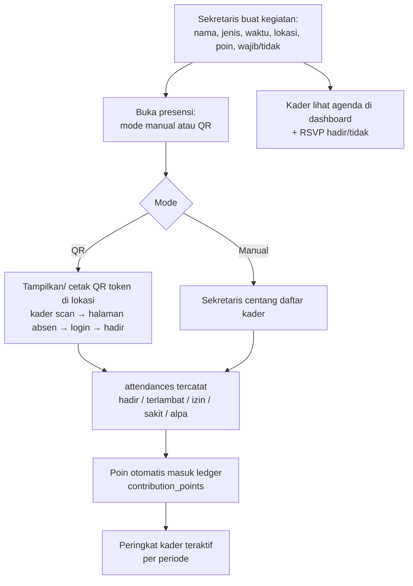

**Aturan**
- Target peserta bisa disaring: semua kader, per angkatan, per unit/LSO, atau pengurus saja.
- Poin per kegiatan diatur di kegiatan (mis. hadir = 10, terlambat = 5, izin = 2, alpa = 0).
- Penyesuaian poin manual oleh Sekretaris **wajib** disertai alasan ⚠️.
- Poin bersifat **per periode kepengurusan** ⚠️ (usulan: hitung per periode agar papan peringkat adil).
- **Agenda publik unit/LSO** (`unit_agendas`) terpisah dari kegiatan internal ini dan **dikelola Konten Manager** ✅ — tanpa presensi.

---

## Alur 10 — Iuran & Pembayaran

**Aktor:** Bendahara (pengelola), Kader Aktif / Pengurus / Alumni (pembayar)

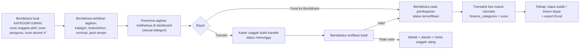

**Aturan**
- ✅ **Kategori iuran diatur Bendahara**, tiga kategori awal: **iuran anggota aktif**, **iuran pengurus**, **iuran alumni**. Bendahara bebas menambah kategori lain.
- ✅ Iuran **alumni** kini ada (sebelumnya dianggap tidak wajib) — dipisah agar nominalnya bisa berbeda.
- Penerima tagihan otomatis dari kategori: `kader_aktif` → semua kader aktif; `pengurus` → pemegang role organisasi; `alumni` → semua alumni.
- **Nominal iuran tidak ditetapkan di dokumen ini** — sepenuhnya wewenang Bendahara lewat CMS ⚠️ (boleh memakai nominal placeholder dulu).
- Menandai lunas tanpa pembayaran (mis. dibebaskan) **wajib** disertai alasan.
- Rekap "belum bayar" bisa dikirim via email (manual dari Bendahara).
- Kategori iuran boleh **dinonaktifkan** tanpa menghapus riwayat tagihan.
- Semua laporan keuangan **internal** ✅ — tidak ada halaman publik.

---

## Alur 11 — Aspirasi ✅

**Aktor:** Publik/Kader/Alumni (pengirim), Sekretaris (penanggap)

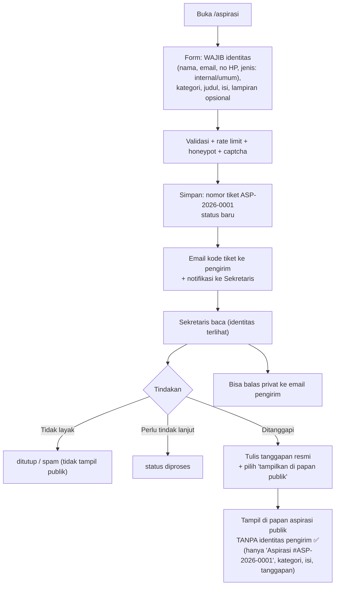

**Aturan**
- Identitas **wajib** diisi ✅, tapi di papan publik **selalu anonim** ✅.
- Menu "papan aspirasi" menampilkan: nomor tiket (atau nomor urut acak), kategori, isi (bisa disunting PII oleh Sekretaris bila pengirim menuliskan identitas di dalam isi), status, dan tanggapan resmi.
- Pengirim bisa cek status dengan **kode tiket** (tanpa login): `/aspirasi/lacak`.
- Status: `baru` → `dibaca` → `diproses` → `ditanggapi` → `selesai` → `ditutup` (+ `spam`).
- ⚠️ Bila pengirim adalah kader/alumni yang login, identitas terisi otomatis dan aspirasinya bisa otomatis diberi label "Aspirasi Kader".
- Sekretaris **tidak** bisa mengubah isi aspirasi, hanya menambah tanggapan & mengaburkan data pribadi di isi (fitur redaksi) ⚠️.

---

## Alur 12 — Kartu Kader & Verifikasi QR ✅

**Aktor:** Sistem, Kader, Publik (verifikator)

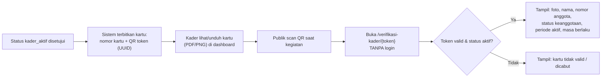

**Aturan**
- Halaman verifikasi **hanya** menampilkan data aman: foto, nama, nomor anggota, status, periode aktif. **Tanpa** NIM, email, HP, alamat.
- Token bersifat rahasia & tidak bisa ditebak (UUID v4). Bisa dicabut dan diterbitkan ulang oleh Sekretaris.
- Masa berlaku kartu mengikuti periode kepengurusan aktif ⚠️ (usulan: 1 tahun akademik, otomatis diperbarui).
- ⚠️ **Perlu konfirmasi:** apakah alumni juga mendapat kartu alumni? Usulan: ya, tanpa presensi/poin, sebagai tanda identitas alumni.

---

## Alur 13 — Pencatatan Kas & Laporan Keuangan ✅ (internal)

**Aktor:** Bendahara, Superadmin (audit)

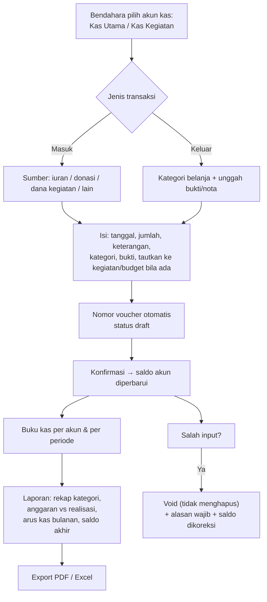

**Aturan**
- Transaksi **tidak pernah dihapus** — hanya di-`void` ✅ (praktik akuntansi & audit).
- Konfirmasi transaksi mengubah `saldo_berjalan` akun. Void mengembalikannya.
- Setiap transaksi wajib punya bukti bila nominal ⚠️ (usulan: di atas Rp100.000 wajib bukti).
- Laporan tersedia: harian, bulanan, per periode kepengurusan, per kategori, per kegiatan, per akun.
- Akses: Bendahara + Superadmin saja ✅. Tidak ada halaman publik.
- ⚠️ **Perlu konfirmasi:** apakah donasi dari pihak luar dicatat sebagai transaksi masuk biasa (sumber `donasi`) tanpa kanal pembayaran online? Usulan: ya.

---

## Alur 14 — Hibah & Dukungan Alumni 🆕

**Aktor:** Alumni (pemberi), Bendahara (penerima & pencatat), Superadmin (audit)

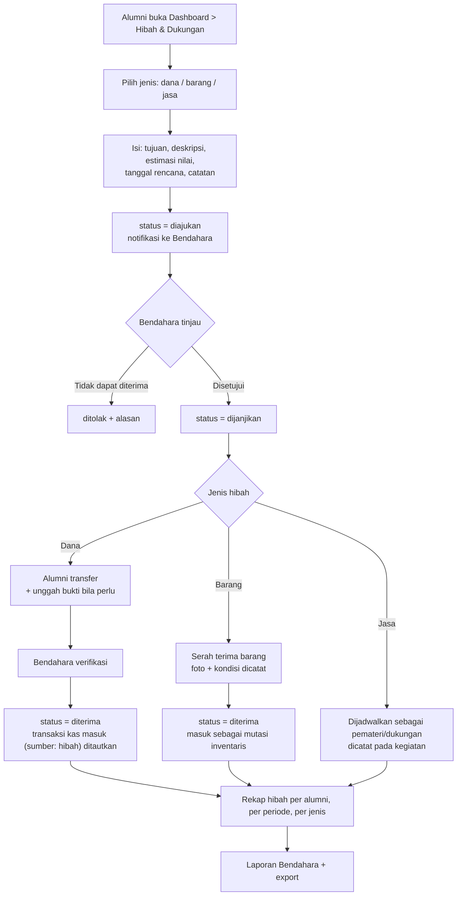

**Aturan**
- Hibah bersifat **internal saja** — tidak ada halaman publik dan tidak ada pembayaran online ✅ (di luar lingkup).
- Jenis hibah: **dana**, **barang**, **jasa** ⚠️ (usulan; bisa ditambah/dikurangi).
- Hibah **dana** wajib ditautkan ke transaksi kas masuk → muncul di laporan keuangan dengan sumber `hibah`.
- Hibah **barang** wajib menghasilkan mutasi inventaris tipe `masuk` 🆕 → otomatis menambah stok aset.
- Hibah **jasa** dicatat sebagai kesediaan (mis. menjadi pemateri PKD) dan bisa ditautkan ke kegiatan.
- Nomor hibah otomatis: `HIB-2026-0001` ⚠️ (format perlu persetujuan).
- Alur status: `diajukan` → `dijanjikan` → `diterima` → `diverifikasi` (atau `ditolak` / `dibatalkan`).
- Bendahara boleh **mencatat hibah secara langsung** (mis. alumni menyerahkan dana tunai di sekretariat tanpa lewat dashboard).
- **Opsi anonim** ⚠️: alumni bisa memilih tidak ditampilkan namanya, termasuk di laporan internal (identitas hanya bisa dilihat Superadmin).
- Rekap: total hibah per tahun & per periode masa juang, daftar alumni pemberi (untuk apresiasi), tren bulanan.
- Apresiasi: Bendahara/Ketua bisa mengirim **ucapan terima kasih** via email + nomor dokumen ⚠️ (opsional).
