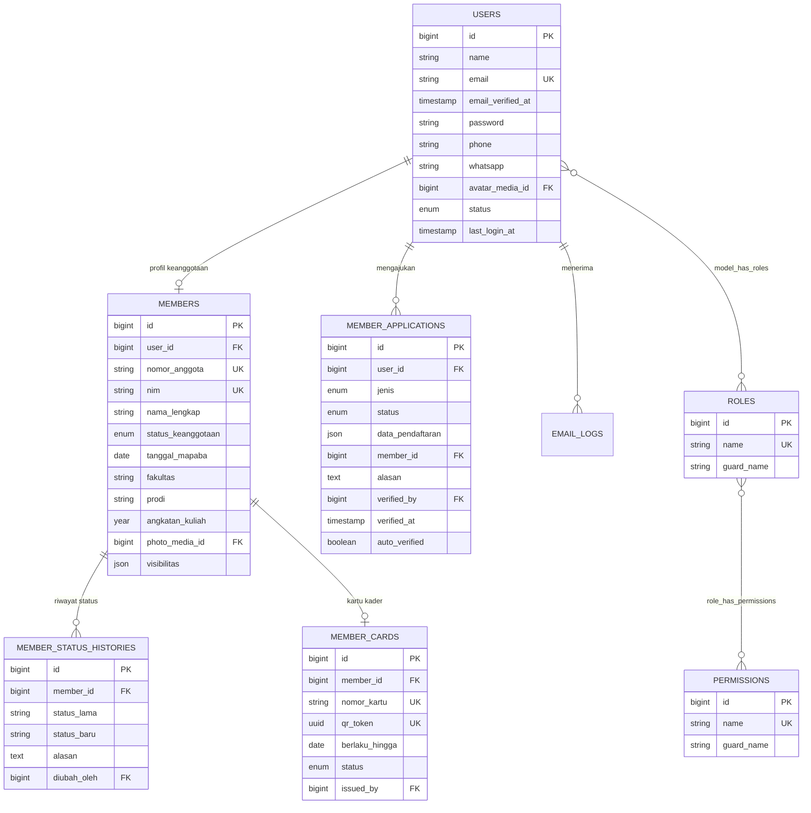
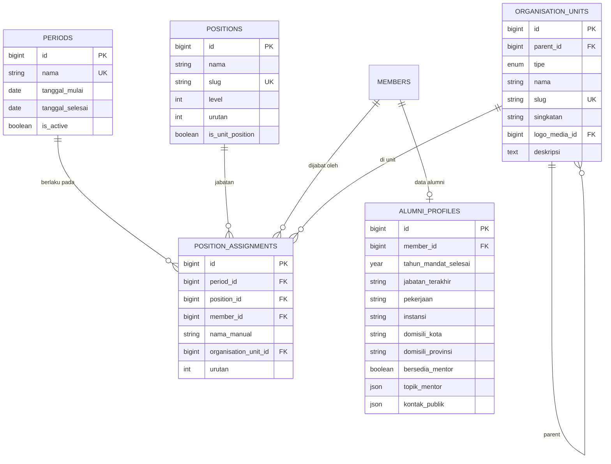
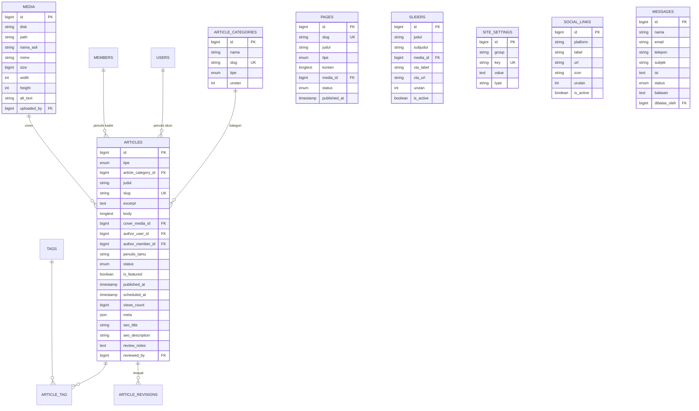
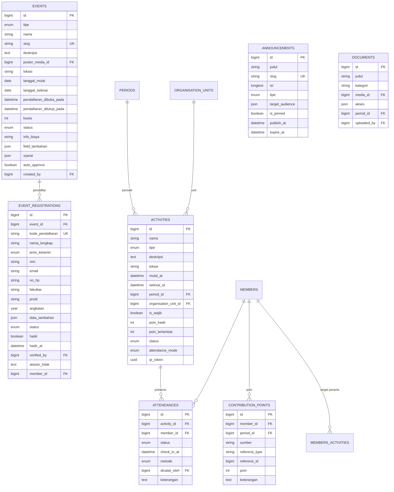
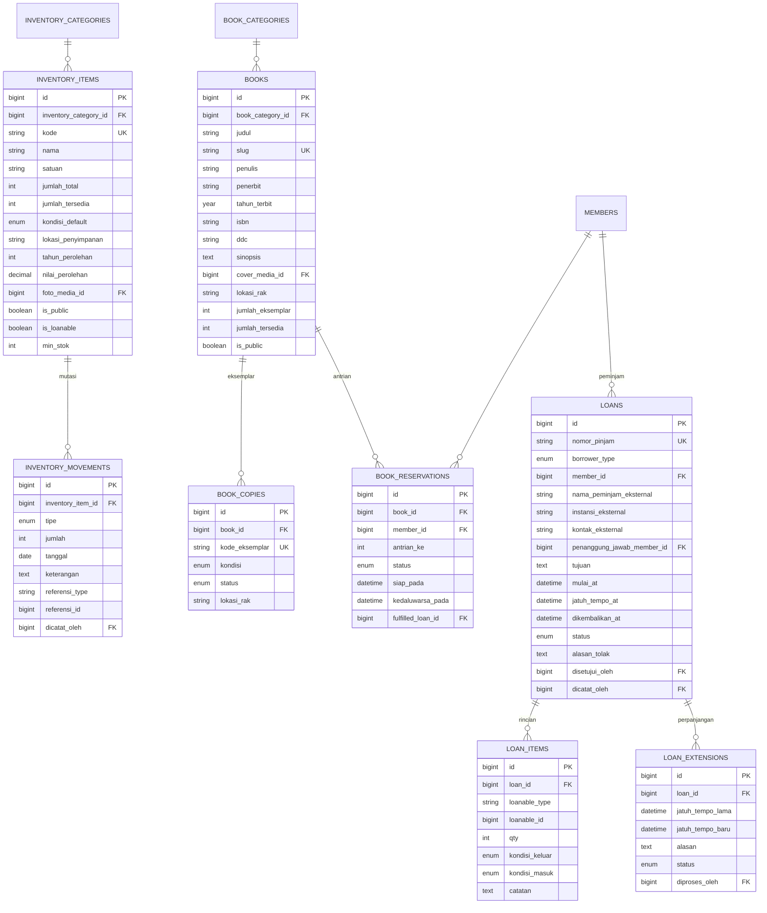
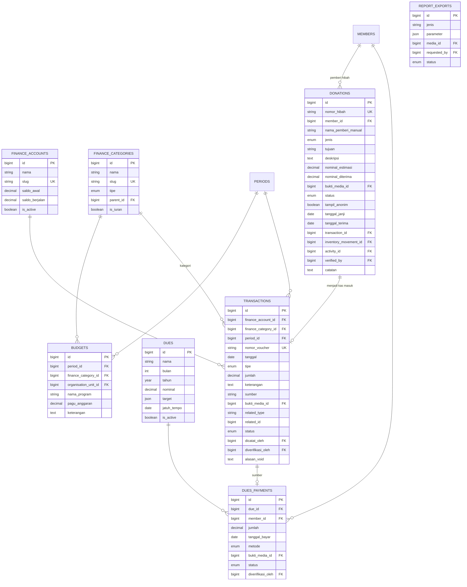
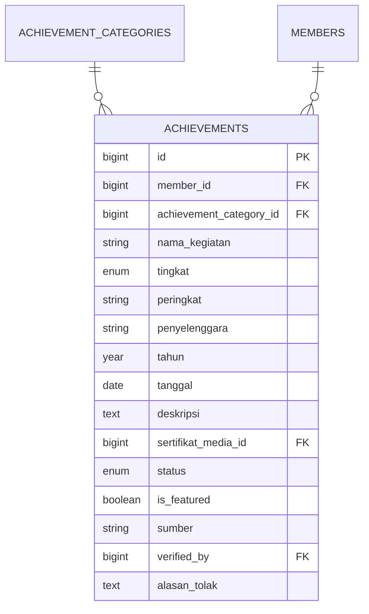
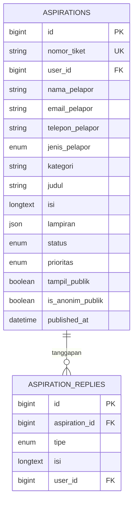
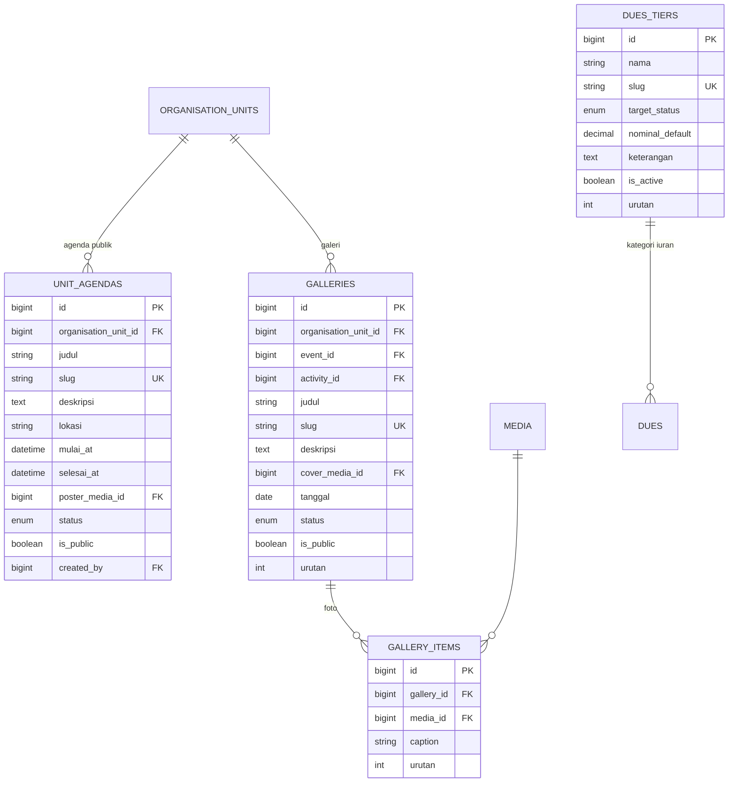

# 04 — Data Model & ERD

> **Fase 0 — Dokumen Spesifikasi.** Status: *menunggu review*. ⚠️ = asumsi, ✅ = sudah dikonfirmasi.
> Total: **± 57 tabel** (termasuk 5 tabel Spatie Permission, `activity_log`, `notifications`, `jobs`, `media`).
> Terjemahan konten memakai **kolom JSON**, bukan tabel terpisah → lihat `10-lokalisasi-bilingual.md`.

## 1. Konvensi

| Aspek | Aturan |
|---|---|
| Nama tabel | `snake_case`, jamak (contoh: `article_categories`) |
| Primary key | `id` bigint unsigned auto increment |
| Foreign key | `{tabel_tunggal}_id` + constraint `nullOnDelete` atau `cascadeOnDelete` sesuai konteks |
| Timestamps | `created_at`, `updated_at` di semua tabel |
| Soft delete | Pada tabel konten & data penting: `articles`, `events`, `books`, `inventory_items`, `members`, `announcements` |
| Audit | `created_by`, `updated_by`, `deleted_by` (FK ke `users`, nullable) pada tabel data resmi |
| Slug | Kolom `slug` unik pada entitas yang punya halaman publik |
| Status | Pakai **string enum** (bukan angka) agar mudah dibaca di DB; dikelola lewat PHP Enum |
| JSON | Kolom `json` untuk data fleksibel (field tambahan event, sosmed, privasi) — bukan untuk data yang sering difilter |
| Media | Relasi ke tabel `media` lewat FK (`cover_media_id`) **atau** polymorhpic (`model_type`/`model_id`) |
| Uang | `decimal(15,2)` — bukan float |
| Zona waktu | Simpan UTC, tampilkan `Asia/Jakarta` |

## 2. Peta Domain

| # | Domain | Jumlah tabel | Pemilik utama |
|---|---|---|---|
| 1 | Identitas & Akses | 11 | Superadmin, Sekretaris |
| 2 | Organisasi & Kepengurusan | 5 | Sekretaris |
| 3 | Konten, Tampilan Situs & Lokalisasi | 11 | Konten Manager |
| 4 | Event, Kegiatan & Pembinaan | 9 | Sekretaris |
| 5 | Aset & Perpustakaan | 10 | Sekretaris |
| 6 | Keuangan, Iuran & Hibah | 9 | Bendahara |
| 7 | Prestasi | 2 | Sekretaris, Konten Manager |
| 8 | Layanan & Interaksi | 4 | Sekretaris |

---

## 3. ERD

### 3.1 Identitas & Akses



### 3.2 Organisasi & Kepengurusan



> `organisation_units.tipe`: `komisariat`, `rayon`, `mabinra`, `biro`, `lso` ✅ — berisi **8 Biro** dan **5 LSO** (Mutasi, Harokatuna, LDR, LPM Albiruni, MJT); setiap LSO punya pengurus & halaman sendiri.
> ✅ Istilah resmi rayon: **Biro** (bukan "Divisi") dan **Kepala Biro/Kabiro** (bukan "Kadiv").

### 3.3 Konten & Tampilan Situs



> `articles.meta` (JSON) dipakai untuk berita acara: `nomor_dokumen`, `agenda`, `lokasi`, `waktu`, `pemimpin_rapat`, `notulis`, `daftar_hadir[]`, `keputusan[]`, `penandatangan[]`, `lampiran[]`.

### 3.4 Event, Kegiatan & Pembinaan



### 3.5 Aset & Perpustakaan



> `loan_items.loanable_type` = `App\Models\InventoryItem` **atau** `App\Models\BookCopy` (polimorfik) — sehingga satu mekanisme peminjaman melayani aset & buku.

### 3.6 Keuangan



### 3.7 Prestasi



### 3.8 Layanan & Interaksi



### 3.9 Galeri, Agenda Unit & Iuran Berkategori 🆕



**Aturan**
- `unit_agendas` = agenda **publik** milik unit (LSO/divisi), **dikelola Konten Manager** ✅ — berbeda dari `activities` (kegiatan internal + presensi, milik Sekretaris). Tidak ada presensi di sini.
- `galleries` bisa menempel ke **unit**, **event**, atau **kegiatan**; `gallery_items` = daftar foto + keterangan.
- Seluruh teks galeri & agenda **dapat diterjemahkan** (lihat `10-lokalisasi-bilingual.md`).
- `dues_tiers` = **kategori iuran** ✅, dikelola Bendahara. Tiga kategori awal: **iuran anggota aktif**, **iuran pengurus**, **iuran alumni**. Bendahara bisa menambah kategori lain.
- `dues` bertambah kolom **`dues_tier_id`** → menentukan siapa yang otomatis mendapat tagihan (berdasarkan `target_status`).

---

## 4. Enum & Status

| Tabel.kolom | Nilai |
|---|---|
| `users.status` | `aktif`, `nonaktif`, `ditangguhkan` |
| `members.status_keanggotaan` | `belum_anggota`, `calon`, `kader_aktif`, `alumni`, `mengundurkan_diri`, `diberhentikan` |
| `member_applications.jenis` | `kader_aktif`, `alumni` |
| `member_applications.status` | `draft`, `menunggu_email`, `menunggu_verifikasi`, `perlu_perbaikan`, `disetujui`, `ditolak`, `kedaluwarsa` |
| `member_cards.status` | `aktif`, `kedaluwarsa`, `dicabut` |
| `organisation_units.tipe` | `komisariat`, `rayon`, `mabinra`, `biro`, `lso` ✅ |
| `articles.tipe` | `berita`, `opini`, `kajian`, `esai`, `sastra`, `berita_acara`, `pers_release` |
| `articles.status` | `draft`, `menunggu_review`, `perlu_revisi`, `dijadwalkan`, `terbit`, `arsip`, `ditolak` |
| `pages.tipe` | `sejarah`, `visi_misi`, `sambutan`, `statis` |
| `pages.status` | `draft`, `terbit` |
| `events.tipe` | `mapaba`, `pkd`, `lainnya` |
| `events.status` | `draft`, `dibuka`, `ditutup`, `berlangsung`, `selesai`, `dibatalkan` |
| `event_registrations.status` | `menunggu`, `terverifikasi`, `cadangan`, `ditolak`, `dibatalkan` |
| `activities.tipe` | `rapat`, `kajian`, `pelatihan`, `sosial`, `lainnya` |
| `activities.status` | `rencana`, `berlangsung`, `selesai`, `dibatalkan` |
| `activities.attendance_mode` | `manual`, `qr` |
| `attendances.status` | `hadir`, `terlambat`, `izin`, `sakit`, `alpa` |
| `inventory_items.kondisi_default` | `baik`, `rusak_ringan`, `rusak_berat` |
| `inventory_movements.tipe` | `masuk`, `keluar`, `penyesuaian_tambah`, `penyesuaian_kurang`, `rusak`, `hilang`, `perbaikan_selesai`, `pengembalian` |
| `book_copies.kondisi` | `baik`, `rusak_ringan`, `rusak_berat`, `hilang` |
| `book_copies.status` | `tersedia`, `dipinjam`, `dipesan`, `rusak`, `perbaikan`, `hilang` |
| `book_reservations.status` | `menunggu`, `siap_diambil`, `selesai`, `kedaluwarsa`, `dibatalkan` |
| `loans.borrower_type` | `member`, `eksternal` |
| `loans.status` | `diajukan`, `disetujui`, `ditolak`, `dipinjam`, `dikembalikan`, `terlambat`, `bermasalah` |
| `loan_extensions.status` | `diajukan`, `disetujui`, `ditolak` |
| `finance_categories.tipe` | `masuk`, `keluar` |
| `transactions.tipe` | `masuk`, `keluar` |
| `transactions.sumber` | `iuran`, `hibah`, `donasi`, `dana_kegiatan`, `inventaris`, `operasional`, `lainnya` |
| `donations.jenis` 🆕 | `dana`, `barang`, `jasa` ⚠️ |
| `donations.status` 🆕 | `diajukan`, `dijanjikan`, `diterima`, `diverifikasi`, `ditolak`, `dibatalkan` |
| `dues_tiers.target_status` 🆕 | `kader_aktif`, `pengurus`, `alumni`, `semua` |
| `unit_agendas.status` 🆕 | `rencana`, `berlangsung`, `selesai`, `dibatalkan` |
| `galleries.status` 🆕 | `draft`, `terbit`, `arsip` |
| `users.locale`, `event_registrations.locale` 🆕 | `id`, `en` |
| `users.preferensi_tema` 🆕 | `terang`, `gelap`, `sistem` |
| `transactions.status` | `draft`, `terkonfirmasi`, `void` |
| `dues.target` | JSON: `{ scope: 'semua'|'angkatan'|'unit', nilai: [...] }` |
| `dues_payments.metode` | `tunai`, `transfer` |
| `dues_payments.status` | `menunggu`, `terverifikasi`, `ditolak` |
| `achievements.tingkat` | `rayon`, `komisariat`, `kota`, `provinsi`, `nasional`, `internasional` ⚠️ |
| `achievements.status` | `diajukan`, `terverifikasi`, `ditolak` |
| `achievements.sumber` | `pengajuan_kader`, `input_pengurus` |
| `aspirations.jenis_pelapor` | `publik`, `kader`, `alumni`, `pengurus` |
| `aspirations.status` | `baru`, `dibaca`, `diproses`, `ditanggapi`, `selesai`, `ditutup`, `spam` |
| `aspirations.prioritas` | `rendah`, `normal`, `tinggi` |
| `aspiration_replies.tipe` | `internal`, `publik` |
| `documents.akses` | JSON: `["publik","kader","alumni","pengurus"]` |
| `announcements.tipe` | `internal`, `publik` |

## 5. Index & Constraint Penting

```text
-- Unik
users.email                                    UNIQUE
members.nim                                    UNIQUE
members.nomor_anggota                          UNIQUE
member_cards.qr_token                          UNIQUE
articles.slug                                  UNIQUE
events.slug                                    UNIQUE
books.slug  /  books.isbn                      UNIQUE (isbn nullable)
inventory_items.kode                           UNIQUE
book_copies.kode_eksemplar                     UNIQUE
event_registrations.kode_pendaftaran            UNIQUE
event_registrations (event_id, email)          UNIQUE  -- cegah daftar ganda
aspirations.nomor_tiket                        UNIQUE
transactions.nomor_voucher                     UNIQUE
dues_payments (due_id, member_id)              UNIQUE  -- cegah tagihan ganda
attendances (activity_id, member_id)           UNIQUE  -- cegah absen ganda

-- Index pencarian & filter
articles (tipe, status, published_at)          INDEX
articles (article_category_id, status)         INDEX
events (tipe, status, pendaftaran_dibuka_pada) INDEX
loans (status, jatuh_tempo_at)                 INDEX
transactions (finance_account_id, tanggal)     INDEX
attendances (activity_id, status)              INDEX
members (status_keanggotaan, angkatan_kuliah)  INDEX

-- Fulltext (MySQL 8 / MariaDB 10.4+)
articles (judul, excerpt, body)                FULLTEXT
books (judul, penulis, sinopsis)               FULLTEXT
```

**Format kode & nomor ✅**

| Kode | Format | Catatan |
|---|---|---|
| **Nomor anggota** | `RAAB-{tahun periode mulai}-{6 digit acak}` — contoh `RAAB-2026-482913` | ✅ **Nomor acak, bukan berurutan** (menyembunyikan jumlah anggota). Dibuat saat status menjadi `kader_aktif`, dicek unik ke database, penomoran **dimulai dari periode saat ini** |
| Nomor kartu kader | `KRT-{nomor anggota}` | — |
| Kode pendaftaran event | `{TIPE}-{tahun}-{4 digit}` → `MAPABA-2026-0147` | — |
| Nomor hibah | `HIB-{tahun}-{4 digit}` | ⚠️ perlu persetujuan |
| Nomor berita acara | `{urut}/BA/RAAB/{bulan romawi}/{tahun}` | ⚠️ perlu persetujuan |
| Nomor voucher transaksi | `{urut}/{KAS}/{bulan romawi}/{tahun}` | — |
| Nomor tiket aspirasi | `ASP-{tahun}-{4 digit}` | — |

**Aturan integritas**
- Menghapus `members` → tidak menghapus presensi/prestasi; gunakan **soft delete** dan pertahankan relasi.
- Menghapus `articles` → `article_tag` ikut terhapus (`cascadeOnDelete`).
- Menghapus `events` yang sudah punya pendaftar → **dilarang** (hanya boleh dinonaktifkan/arsip).
- Menghapus `transactions` → **dilarang** (hanya `void`).
- `media` yang masih direferensikan tidak boleh dihapus (cek relasi sebelum hapus).

## 6. Penyimpanan Media

| Konteks | Disk | Catatan |
|---|---|---|
| Gambar umum | `public` (`storage/app/public`) | Symlink `public/storage`; fallback `public/uploads` bila hosting melarang symlink ⚠️ |
| Dokumen PDF (berita acara, laporan) | `local` | Diunduh lewat route ber-proteksi, bukan URL publik |
| Sertifikat prestasi, bukti transfer, bukti transaksi | `local` | **Sensitif** — hanya pemilik/verifikator yang bisa mengunduh |
| Foto kader | `public` | Di-resize otomatis (thumbnail 96px, medium 480px) |
| Cover artikel & poster event | `public` | Konversi ke WebP + ukuran maks. 1600px |

## 7. Data Awal (Seeder) yang Diusulkan

| Seeder | Isi |
|---|---|
| `RolePermissionSeeder` | 4 role + ±125 permission sesuai `02-role-permission.md` |
| `SuperadminSeeder` | 1 akun superadmin (kredensial dari `.env`, wajib ganti password saat login pertama) |
| `SettingSeeder` | **PMII Rayon Ali Ahmad Baktsir**, **PMII Komisariat Raden Mas Said — Cabang Sukoharjo**, **UIN Raden Mas Said Surakarta**; alamat/jam/maps/lokasi **placeholder**, SEO default, parameter perpustakaan (7 hari, 1× perpanjang, 2 buku, 2×24 jam ambil, **tanpa denda**) |
| `PeriodSeeder` | Periode **Masa Juang** berlaku 1 tahun, dari **2017** s/d periode aktif sekarang → 10 periode placeholder ✅ |
| `PositionSeeder` | Struktur tetap: **Mabinra** → **Ketua Rayon** → **Wakil Ketua** → **Sekretaris 1** → **Sekretaris 2** → **Bendahara 1** → **Bendahara 2** → **8 Kepala Biro (Kabiro)** + jabatan unit untuk LSO ✅ |
| `UnitSeeder` | **8 Biro** (Advokasi & Gerakan/Advoger, Kaderisasi, Keilmuan, Keagamaan, **Gender**, Kebudayaan, Media, Kewirausahaan) + **5 LSO** (Mutasi, Harokatuna, LDR, LPM Albiruni, MJT) — deskripsi placeholder ✅ |
| `CategorySeeder` | Tipe artikel (berita, opini, kajian, esai, sastra, berita_acara, pers_release), kategori inventaris (elektronik, perlengkapan, ATK, kendaraan), kategori buku (DDC ringkas), kategori keuangan (iuran, hibah, donasi, operasional, kegiatan, inventaris) |
| `FinanceAccountSeeder` | Kas Utama + Kas Kegiatan (saldo awal 0) |
| `DuesTierSeeder` 🆕 | 3 kategori iuran: **iuran anggota aktif**, **iuran pengurus**, **iuran alumni** — nominal placeholder, nominal & target diatur Bendahara ✅ |
| `PageSeeder` | Halaman Sejarah, Visi & Misi, Sambutan — **versi ID + EN** (contoh dwibahasa) |
| `DemoSeeder` | Data contoh: 30 anggota, 20 alumni, 12 artikel, 5 prestasi, **50 judul buku / 150 eksemplar** ⚠️ placeholder, 15 aset, 3 event, 2 periode kepengurusan, 5 LSO lengkap dengan galeri & agenda (nonaktif di produksi) |

### Struktur Jabatan Placeholder ✅

| Level bagan | Jabatan |
|---|---|
| 0 — Pembina | **Mabinra** (Majelis Pembina Rayon) |
| 1 | **Ketua Rayon** |
| 2 | **Wakil Ketua** |
| 3 | **Sekretaris 1**, **Sekretaris 2** |
| 3 | **Bendahara 1**, **Bendahara 2** |
| 4 — Koordinator | **Kepala Biro (Kabiro)**: Advokasi & Gerakan (Advoger) · Kaderisasi · Keilmuan · Keagamaan · **Gender** · Kebudayaan · Media · Kewirausahaan |
| 5 | Anggota Divisi ⚠️ (opsional) |
| Unit LSO | Ketua · Wakil · Sekretaris · Bendahara · Anggota (per LSO) |

> ✅ Istilah resmi: **Biro** (bukan "Divisi") dan **Kepala Biro/Kabiro** (bukan "Kadiv"). Unit **Biro Gender** sudah termasuk.
> ⚠️ "Wakil" saya baca sebagai **Wakil Ketua**; "Sekertaris" ditulis **Sekretaris** (ejaan baku). Mohon koreksi bila ada jabatan yang kurang.

## 8. Catatan Migrasi & Data Lama

✅ Konfirmasi kamu: data lama **ada**, tetapi untuk MVP dipakai **placeholder** dulu; impor menyusul.

| Data | Bentuk | Rencana |
|---|---|---|
| Daftar anggota/kader | ⚠️ bentuk berkasnya belum disebutkan | Alat impor CSV + pemetaan kolom, dijalankan setelah Fase 2 |
| Daftar alumni | ⚠️ idem | Sama, setelah Fase 4 |
| Katalog buku | ⚠️ idem | Impor CSV (judul, penulis, ISBN, jumlah eksemplar) setelah Fase 6 |
| Inventaris aset | ⚠️ idem | Impor CSV setelah Fase 6 |
| Prestasi kader | ⚠️ idem | Impor setelah Fase 8 |
| Riwayat keuangan lampau | ⚠️ idem | Usulan: **tidak** dimigrasi; mulai dari saldo awal saja |

> Untuk MVP, `DemoSeeder` mengisi data contoh agar tampilan tidak kosong. Sub-fase "Impor Data" ditambahkan ke roadmap (`05-roadmap-fase.md`) dan skema CSV akan disepakati sebelum dijalankan.
