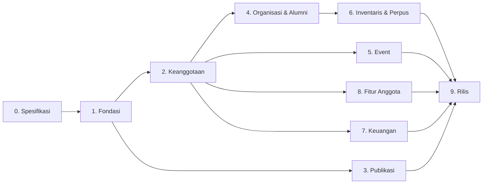

# 05 — Roadmap Fase

> **Fase 0 — Dokumen Spesifikasi.** Status: *menunggu review*.
> Prinsip: **satu fase tuntas dulu, baru lanjut** ✅. Setiap fase menghasilkan sesuatu yang bisa kamu lihat dan pakai.
> Bobot: 🟢 ringan · 🟡 sedang · 🔴 berat — menunjukkan kerumitan relatif, bukan satuan waktu.

## Ringkasan Fase

| Fase | Nama | Bobot | Hasil utama |
|---|---|---|---|
| 0 | Spesifikasi & Perencanaan | 🟢 | Dokumen ini + persetujuanmu |
| 1 | Fondasi & Kerangka | 🔴 | Situs publik **Blade** tampil (**bilingual + mode gelap**), panel admin Inertia+Vue, login multi-role, CMS halaman statis, media |
| 2 | Keanggotaan & Verifikasi | 🔴 | Pendaftaran kader/alumni + verifikasi + dashboard dasar |
| 3 | Publikasi & Konten Publik | 🟡 | Berita, opini, kajian, esai, sastra + review workflow |
| 4 | Organisasi & Alumni | 🟡 | Struktur multi-periode, anggota, LSO, direktori alumni |
| 5 | Event Mapaba & PKD | 🟡 | Pendaftaran online + manajemen peserta |
| 6 | Inventaris & Perpustakaan | 🔴 | Aset, buku, peminjaman, perpanjangan, reservasi |
| 7 | Keuangan (internal) | 🟡 | Kas, iuran, anggaran, laporan |
| 8 | Fitur Anggota Lanjutan | 🔴 | Kartu kader + QR, presensi, poin, prestasi, aspirasi, pengumuman, arsip |
| 9 | Penyempurnaan & Rilis | 🟡 | SEO, performa, keamanan, deploy MVP ke **free tier**, dokumentasi |

> Fase 3 dan 7 bisa dikerjakan lebih awal bila kamu ingin situs publik cepat tampil. Urutan di atas adalah usulan saya: **fondasi & keanggotaan dulu**, karena hampir semua modul bergantung pada identitas pengguna.

---

## Fase 0 — Spesifikasi & Perencanaan 🟢

**Tujuan:** menyepakati lingkup sebelum menulis kode.

| Deliverable | Status |
|---|---|
| `01-ringkasan-produk.md` | ✅ selesai |
| `02-role-permission.md` | ✅ selesai |
| `03-alur-bisnis.md` | ✅ selesai |
| `04-data-model.md` | ✅ selesai |
| `05-roadmap-fase.md` | ✅ dokumen ini |
| `06-teknis-hosting.md` | ✅ selesai |
| `07-asumsi-terbuka.md` | ✅ selesai |

**Kriteria selesai:** kamu menyetujui dokumen ini, dan poin ⚠️ di `07-asumsi-terbuka.md` sudah dijawab (minimal yang memblokir Fase 1).

---

## Fase 1 — Fondasi & Kerangka 🔴

**Tujuan:** kerangka aplikasi yang benar dari awal — auth, role, layout, CMS halaman statis.

| Lapisan | Deliverable |
|---|---|
| Proyek | **Laravel 13** + Vite 8 + Tailwind v4; **Blade + Alpine.js** untuk halaman publik, **Inertia + Vue 3 (TS)** untuk admin/dashboard; struktur folder, ESLint/Prettier, Pest |
| Auth | Login/logout, lupa password, ganti password, verifikasi email, throttling |
| Role | Spatie Permission dengan 4 role + ±120 permission, seeder lengkap |
| Layout publik | **Komponen Blade**: navbar (7 menu dari mind map, responsif + dropdown + tombol bahasa + tombol tema), footer (layanan + sosmed + kontak) |
| Layout admin | Sidebar per role, breadcrumb, komponen tabel/filter/pagination, notifikasi toast, modal, konfirmasi hapus |
| Layout anggota | Dashboard shell (belum berisi modul, hanya ringkasan) |
| **Lokalisasi** 🆕 | Prefiks `/en`, middleware bahasa, `lang/id` + `lang/en`, tombol ID/EN, `$t()` di semua komponen, `hreflang`, sitemap per bahasa → `10-lokalisasi-bilingual.md` |
| **Mode gelap** 🆕 | Token warna gelap, pilihan Terang/Gelap/Sistem, penyimpanan preferensi, anti-kedip → `08-desain-visual.md` |
| Halaman statis | CMS untuk Sejarah, Visi & Misi, Sambutan (+ editor rich text) |
| Pengaturan situs | Nama rayon, komisariat, alamat, maps, jam operasional, sosmed — dipakai di footer & halaman Layanan |
| Media | Media library: upload, crop/rasio, alt text, thumbnail, pilih-dari-library |
| Beranda | Hero/slider dari CMS, statistik dasar, sambutan singkat, placeholder berita & prestasi |
| Keamanan dasar | Rate limit, CSRF, permission middleware, Policy, `activity_log` |

**Halaman publik di fase ini:** `/`, `/sejarah`, `/visi-misi`, `/sambutan`, `/kontak`, `/lokasi`, `/media-sosial`, `/masuk`, `/daftar` (form tampil, verifikasi belum aktif)

**Kriteria selesai**
- [ ] Superadmin bisa login, membuat pengurus lain, mengatur role
- [ ] Konten Sejarah/Visi & Misi/Sambutan bisa diubah dari CMS dan langsung tampil di publik
- [ ] Footer & halaman Kontak/Lokasi mengambil data dari pengaturan situs
- [ ] Media library berfungsi (upload + pilih ulang gambar)
- [ ] Setiap role hanya melihat menu yang berhak
- [ ] Situs sudah rapi di layar 360px
- [ ] Berpindah bahasa ID ⇄ EN tetap di halaman yang sama, tanpa teks yang tertinggal
- [ ] Mode gelap rapi di seluruh halaman (uji gelap × mobile 360px)

---

## Fase 2 — Keanggotaan & Verifikasi 🔴

**Tujuan:** sistem identitas anggota yang menjadi fondasi semua modul berikutnya.

| Modul | Deliverable |
|---|---|
| Pendaftaran | Halaman `/daftar` dengan 2 jalur (Kader Aktif / Alumni), validasi lengkap |
| Verifikasi email | Signed link 60 menit, kirim ulang, template email |
| Antrean verifikasi | Daftar pendaftar, detail (termasuk identitas sensitif), setujui / tolak / minta perbaikan, catatan |
| Auto-verifikasi | Pendaftaran oleh pemegang role langsung `kader_aktif` ✅ |
| Nomor anggota | Generator otomatis `RAAB-{tahun}-{urut}` ⚠️ format perlu persetujuan |
| Profil anggota | Kader isi/ubah profil sendiri: data diri, foto, keahlian, sosmed, privasi |
| Riwayat status | `member_status_histories` + tampilan riwayat |
| Dashboard kader | Ringkasan: kartu ringkas, status keanggotaan, menu fitur (masih kosong/placeholder) |
| Dashboard alumni | Ringkasan + form profil alumni lengkap |
| Naik status | Sekretaris ubah kader → alumni (satuan & massal) + email pemberitahuan |
| Direktori dasar | Halaman `/anggota` & `/alumni` dengan field publik terbatas + filter angkatan |
| Notifikasi | Email transaksional via Brevo/Resend ✅ + antrean via cron |

**Kriteria selesai**
- [ ] Pendaftar eksternal tidak bisa masuk sebelum diverifikasi Sekretaris
- [ ] Pengurus yang mendaftar anggota langsung terverifikasi ✅
- [ ] Sekretaris tidak bisa memverifikasi dirinya sendiri ✅
- [ ] Naik status kader → alumni memindahkan profil ke direktori alumni dan mencabut akses kartu/presensi
- [ ] Data sensitif (NIM/HP/email) tidak muncul di halaman publik

---

## Fase 3 — Publikasi & Konten Publik 🟡

**Tujuan:** situs hidup — berita & karya kader terbit.

| Modul | Deliverable |
|---|---|
| Artikel | 5 tipe ✅ (berita, opini, kajian, esai, sastra) + kategori + tag + penjadwalan terbit |
| Terjemahan konten 🆕 | Kolom ID + EN pada artikel/kategori/tag + indikator kelengkapan ("ID ✅ · EN 60%") + filter "belum diterjemahkan" |
| Terjemahan otomatis 🆕 | Adaptor penerjemah (`deepl`/`google`/`none`), terjemahan ID→EN saat simpan lewat antrean, glosarium istilah organisasi, tombol "Terjemahkan ulang" |
| Editor | Rich text (TipTap) + gambar di dalam isi + embed + blok kutipan (untuk sastra) |
| Review workflow | Draft → menunggu review → perlu revisi → terbit/ditolak, dengan catatan review + notifikasi |
| Submisi kader | Kader mengirim karya dari dashboard, melihat status & catatan revisi |
| Berita acara | Tipe khusus Sekretaris, publish langsung ✅, field dokumen (nomor, agenda, keputusan, penandatangan) + export PDF |
| Halaman publik | `/publikasi` + halaman per tipe + detail artikel + penulis + artikel terkait + share |
| Beranda | "Berita Terbaru" otomatis dari artikel terbit |
| Revisi | `article_revisions` (10 terakhir) + lihat perbandingan sederhana |
| Statistik | Jumlah dibaca, artikel terpopuler (internal), daftar artikel per penulis |

**Kriteria selesai**
- [ ] Kader bisa mengirim karya dari dashboard dan melihat prosesnya
- [ ] Konten Manager bisa menolak/meminta revisi dengan catatan
- [ ] Sastra punya tampilan baca yang nyaman
- [ ] Berita acara bisa di-export PDF dengan nomor dokumen
- [ ] Artikel dijadwalkan terbit otomatis sesuai waktu

---

## Fase 4 — Organisasi & Alumni 🟡

**Tujuan:** wajah organisasi — kepengurusan, LSO, dan jaringan alumni.

| Modul | Deliverable |
|---|---|
| Periode | CRUD periode kepengurusan (**hanya Superadmin** ✅) + penanda periode aktif, multi-periode dari 2017 |
| Jabatan | CRUD jabatan (dengan urutan & level untuk bagan) ⚠️ daftar perlu darimu |
| Penugasan | Susun pengurus per periode; bisa menunjuk bukan-anggota (nama manual) |
| Struktur | Halaman `/struktur` dengan bagan (org chart) + pemilih periode |
| Unit, Biro & LSO | CRUD **Biro (8)** & **LSO (5)** ✅ + halaman publik `/lso` dan 5 halaman LSO dengan pengurus & profil |
| Galeri & agenda LSO 🆕 | Album foto (`galleries`, `gallery_items`) + agenda publik unit (`unit_agendas`) — **dikelola Konten Manager** ✅ |
| Anggota | Direktori lanjutan: filter fakultas/prodi/angkatan/unit, pencarian, profil kader publik |
| Kader berprestasi | Halaman `/prestasi/kader/{slug}` — profil publik + prestasi + karya (prestasi diisi Fase 8) |
| Alumni | Direktori alumni: filter angkatan/bidang/domisili/instansi, peta sebaran (leaflet) + privasi per alumni |
| Mentor | Alumni menandai kesediaan jadi mentor/pemateri + daftar bagi Sekretaris |

**Kriteria selesai**
- [ ] Ganti periode tidak merusak data periode lama
- [ ] Bagan struktur enak dibaca di HP
- [ ] Alumni bisa menyembunyikan kontak dari direktori
- [ ] Peta sebaran alumni tampil dan akurat

---

## Fase 5 — Event Mapaba & PKD 🟡

**Tujuan:** pendaftaran online terkontrol.

| Modul | Deliverable |
|---|---|
| Event | CRUD event, poster, kuota, jadwal buka/tutup, syarat, field tambahan fleksibel ✅ |
| Landing publik | `/pendaftaran/mapaba` & `/pendaftaran/pkd`: info, hitung mundur, sisa kuota, tombol daftar |
| Form pendaftaran | Tanpa akun ✅, validasi server-side, captcha + honeypot, konfirmasi email + kode pendaftaran |
| Manajemen peserta | Daftar peserta, filter status, verifikasi/tolak, tandai hadir, catatan |
| Export & cetak | Export Excel, cetak kartu peserta |
| Promosi ke anggota | Tombol "jadikan Kader Aktif" → undangan akun dengan data terisi ✅ |
| Arsip | Daftar event lampau tetap bisa dibuka publik |

**Kriteria selesai**
- [ ] Pendaftaran tertutup otomatis saat kuota penuh atau melewati tanggal
- [ ] Pendaftar ganda dengan email sama ditolak
- [ ] Export Excel siap dipakai panitia
- [ ] Peserta yang lulus bisa diubah jadi kader aktif tanpa input ulang data

---

## Fase 6 — Inventaris & Perpustakaan 🔴

**Tujuan:** aset rayon tertata + perpustakaan berjalan.

| Modul | Deliverable |
|---|---|
| Kategori & aset | CRUD kategori, aset (kode, jumlah, kondisi, lokasi, foto, nilai) ✅ |
| Mutasi stok | Barang masuk/keluar, penyesuaian, rusak, hilang, perbaikan + riwayat ✅ |
| Katalog publik | `/inventaris` read-only (hanya barang `is_public`) ✅ |
| Buku | CRUD katalog buku (penulis, ISBN, penerbit, DDC, sinopsis, cover, rak) + eksemplar per copy ✅ |
| Katalog publik buku | `/perpustakaan`: pencarian judul/penulis/ISBN, filter kategori, status ketersediaan |
| Peminjaman | Pengajuan (kader & alumni ✅), persetujuan, serah terima (kondisi keluar/masuk), pengembalian, riwayat |
| Pinjaman eksternal | Pencatatan oleh Sekretaris + **wajib** penanggung jawab internal ✅ |
| Perpanjangan | Pengajuan + persetujuan, maks. 1x ✅ (parameter di CMS) |
| Reservasi/antrian | Antrian otomatis, notifikasi "siap diambil", masa berlaku 2×24 jam, kedaluwarsa otomatis ✅ |
| Pengingat | Email H-1 jatuh tempo + pengingat harian untuk yang terlambat |
| Dashboard peminjam | "Sedang dipinjam" + riwayat pinjam |
| Tanpa denda ✅ | Tidak ada perhitungan denda di seluruh modul |

**Kriteria selesai**
- [ ] Stok aset & jumlah eksemplar buku selalu konsisten setelah pinjam/kembali
- [ ] Antrian otomatis naik saat buku dikembalikan
- [ ] Barang rusak/hilang tercatat sebagai mutasi + penanggung jawab
- [ ] Kader & alumni bisa meminjam dari dashboard masing-masing

---

## Fase 7 — Keuangan (internal) 🟡

**Tujuan:** catatan uang rayon yang rapi dan bisa diaudit.

| Modul | Deliverable |
|---|---|
| Akun kas | Kas Utama, Kas Kegiatan; saldo awal & saldo berjalan |
| Kategori | Kategori masuk & keluar bertingkat |
| Transaksi | Catat masuk/keluar, nomor voucher otomatis, bukti/nota, tautkan ke kegiatan/anggaran |
| Konfirmasi & void | Konfirmasi mengubah saldo; **tidak ada hapus**, hanya void + alasan ✅ |
| Iuran | Tagihan iuran (bulan/tahun, nominal, target), pembayaran tunai/transfer + unggah bukti, verifikasi |
| Rekap iuran | Siapa sudah/belum bayar, pengingat manual, export Excel |
| Anggaran | RKAT per periode + realisasi per kategori/kegiatan |
| Laporan | Buku kas, arus kas bulanan, rekap kategori, anggaran vs realisasi, saldo akhir — export PDF/Excel |
| Hibah alumni 🆕 | Alumni mengajukan hibah **dana/barang/jasa** → verifikasi Bendahara → dana menjadi kas masuk (sumber `hibah`), barang menjadi mutasi inventaris, jasa dicatat ke kegiatan |
| Hak akses | Bendahara + Superadmin saja ✅ (tanpa halaman publik) |

**Kriteria selesai**
- [ ] Saldo tidak pernah bisa berubah tanpa jejak
- [ ] Transaksi void mengembalikan saldo dengan benar
- [ ] Laporan bulanan & per periode bisa di-export
- [ ] Role lain sama sekali tidak bisa membuka halaman keuangan
- [ ] Hibah alumni tercatat benar: dana → kas, barang → stok inventaris, jasa → kegiatan

---

## Fase 8 — Fitur Anggota Lanjutan 🔴

**Tujuan:** melengkapi pengalaman kader & alumni (semua fitur yang kamu pilih ✅).

| Modul | Deliverable |
|---|---|
| Kartu kader | Terbit otomatis saat status aktif, kartu digital + QR, unduh PDF/PNG, halaman verifikasi publik `/verifikasi-kader/{token}` ✅ |
| Presensi | Kegiatan/agenda, mode manual & QR, RSVP, rekap kehadiran per kader & per kegiatan |
| Poin kontribusi | Poin otomatis dari presensi/artikel/prestasi, penyesuaian manual + alasan, papan peringkat per periode |
| Prestasi | Submisi kader + sertifikat, verifikasi Sekretaris/Konten Manager, tayang di `/prestasi` + profil kader + unggulan di beranda ✅ |
| Pengumuman | Pengumuman internal/publik, pin, masa berlaku, target audiens |
| Arsip | Dokumen internal (AD/ART, template surat, hasil rapat) dengan kontrol akses per audiens |
| Aspirasi | Form wajib identitas ✅, nomor tiket, lacak status tanpa login, tanggapan resmi, papan publik anonim, redaksi PII |
| Hibah alumni 🆕 | Alumni mengajukan & memantau hibah (dana/barang/jasa), riwayat kontribusi, opsi anonim |
| Notifikasi | Pusat notifikasi in-app + preferensi email |
| Poin & laporan | Export laporan kegiatan, presensi, poin, prestasi |

**Kriteria selesai**
- [ ] Kartu kader bisa diverifikasi publik dan menolak token tidak valid/dicabut
- [ ] Scan QR presensi tidak bisa dipakai dua kali oleh orang yang sama
- [ ] Papan peringkat kader teraktif sesuai data presensi & kontribusi
- [ ] Aspirasi tampil publik tanpa identitas, tapi identitas tetap tersimpan untuk pengurus

---

## Fase 9 — Penyempurnaan & Rilis 🟡

**Tujuan:** siap dipakai publik dan dipelihara.

| Area | Deliverable |
|---|---|
| SEO | Meta tag per halaman, Open Graph, JSON-LD (Organization & Article), `sitemap.xml`, `robots.txt`, kanonik URL |
| Performa | Eager loading, index DB, cache pengaturan & halaman statis, konversi gambar WebP, lazy load |
| Keamanan | Audit permission per route, captcha di semua form publik, kebijakan password, opsi 2FA superadmin, header keamanan |
| Backup | Backup database harian via cron + unduh berkala, prosedur restore terdokumentasi |
| Monitoring | Log error, pencatatan email gagal, halaman 404/500 yang ramah |
| Dokumentasi | Panduan pengguna per role (PDF/notion) + panduan deploy & pembaruan |
| Uji akhir | Feature test alur kritis, uji lintas browser, uji mobile, uji beban ringan |
| Go-live 9A | **Deploy MVP ke free tier** (Render + TiDB + Cloudflare R2 + Brevo + cron eksternal) — lihat `09-deploy-mvp-free-tier.md` |
| Go-live 9B | Pindah ke hosting berbayar murah saat rilis: domain `.my.id`, email resmi + SPF/DKIM, cron server, cadangan otomatis |

**Kriteria selesai**
- [ ] Semua alur di `03-alur-bisnis.md` berjalan di server produksi
- [ ] Backup otomatis terbukti bisa dipulihkan
- [ ] Tidak ada data sensitif yang bocor ke publik (uji manual menyeluruh)
- [ ] Panduan pengguna selesai untuk Sekretaris, Bendahara, Konten Manager, Kader

---

## Sub-Fase Impor Data (menyusul)

Kamu konfirmasi **data lama ada**, tapi MVP memakai **placeholder** dulu ✅. Impor dikerjakan setelah modul terkait selesai:

| Sub-fase | Data yang diimpor | Setelah fase |
|---|---|---|
| I1 | Anggota/kader | Fase 2 |
| I2 | Alumni | Fase 4 |
| I3 | Katalog buku & inventaris aset | Fase 6 |
| I4 | Prestasi kader | Fase 8 |

### Sub-Fase Terjemahan (T) 🆕

| Sub-fase | Isi | Setelah fase |
|---|---|---|
| T1 | Terjemahan halaman statis, profil LSO, agenda & galeri | Fase 4 |
| T2 | Terjemahan artikel lama | Fase 3 |
| T3 | Audit seluruh label antarmuka — memastikan tidak ada sisa teks Indonesia di versi EN | Fase 8 |

**Prasyarat:** skema CSV disepakati dulu + contoh berkas nyata + aturan penanganan data ganda/kosong.

---

## Yang Tidak Dikerjakan (selama fase 0–9)

- Payment gateway / pembayaran online ✅
- Multi-bahasa, aplikasi mobile native, realtime chat
- Modul surat-menyurat penuh (surat masuk/keluar) ✅
- Auto-posting ke media sosial
- Komentar publik di artikel ⚠️ (bisa ditambah nanti bila kamu mau)
- Denda keterlambatan ✅ (secara desain tidak ada)

## Cara Kita Bekerja per Fase

1. Saya kerjakan satu fase sampai tuntas (migrasi → backend → UI → tes).
2. Saya tunjukkan hasilnya (halaman bisa kamu buka/lihat) + ringkasan apa yang berubah.
3. Kamu uji; saya perbaiki temuan.
4. Baru lanjut ke fase berikutnya.
5. Setiap fase saya perbarui `docs/` bila ada keputusan baru.
