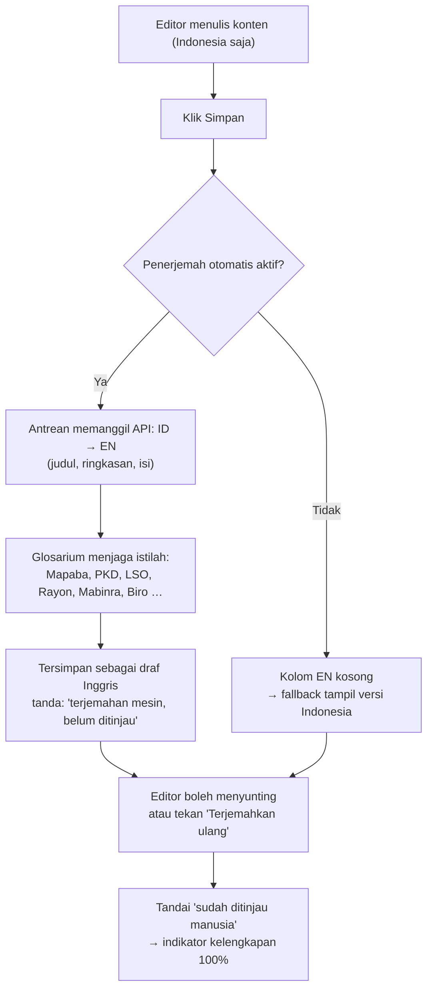
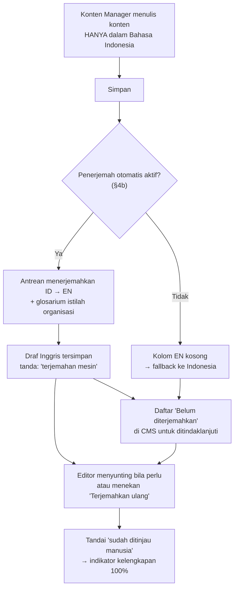

# 10 — Bilingual (Indonesia ⇄ Inggris)

> **Fase 0 — Dokumen Spesifikasi.** Status: *menunggu review*.
> ✅ Permintaanmu: situs perlu **dua bahasa: Indonesia & Inggris**, dengan pengalaman seperti tombol terjemahan pada peramban — **isi sekali dalam bahasa Indonesia, publik bebas berganti ID/EN**. Jawaban teknisnya ada di **§4b**.
> ✅ Semua pertanyaan **L1–L6 sudah dijawab** (lihat §9). ⚠️ = masih perlu keputusanmu.
> Dokumen ini **wajib disetujui sebelum Fase 1**, karena memengaruhi struktur database, URL, dan SEO.

---

## 1. Mengapa Ini Harus Diputuskan Sekarang

Menerjemahkan konten bukan sekadar menambah tombol bahasa. Ada 4 lapisan yang harus disiapkan sejak awal:

| Lapisan | Kalau ditunda |
|---|---|
| **Database** — kolom konten harus bisa menyimpan 2 bahasa | Migrasi ulang semua tabel konten + menulis ulang query |
| **URL** — struktur tautan per bahasa | Semua tautan & sitemap yang sudah terindeks jadi rusak |
| **Antarmuka** — semua teks tombol/label | Menyisir ulang seluruh komponen Vue satu per satu |
| **Email** — bahasa penerima | Template email ditulis ulang |

Karena itu saya kunci sejak Fase 1.

---

## 2. Ruang Lingkup Penerjemahan ⚠️

### Usulan saya

| Area | Diterjemahkan? | Alasan |
|---|---|---|
| **Antarmuka publik** (menu, tombol, label, pesan error) | ✅ Ya | Wajib untuk pengunjung asing |
| **Halaman statis** (Sejarah, Visi & Misi, Sambutan) | ✅ Ya | Profil organisasi untuk publik luar |
| **Artikel** (semua 7 tipe) | ✅ Ya (opsional per artikel) | Berita/karya bisa punya versi Inggris |
| **Profil LSO**, tagline, deskripsi, galeri (keterangan) | ✅ Ya | Perkenalan LSO ke mitra luar |
| **Agenda LSO & kegiatan publik** | ✅ Ya | Informasi jadwal |
| **Event Mapaba/PKD** (nama, deskripsi, syarat) | ✅ Ya | Peserta potensial dari luar |
| **Kategori, tag, label badge** | ✅ Ya | — |
| **Pengaturan situs** (nama, alamat, jam, deskripsi singkat) | ✅ Ya | — |
| **Preferensi antarmuka** (mode gelap/terang) | ✅ Ya | Label tombol |
| **Email publik** (verifikasi, konfirmasi event, kode aspirasi) | ✅ Ya | Mengikuti bahasa pendaftar |
| **Panel admin** (seluruh isi CMS) | ❌ **Tidak** — tetap Indonesia ✅ | Jawabanmu: cukup Indonesia saja |
| **Dashboard kader & alumni** | ❌ Indonesia ✅ | Jawabanmu: cukup Indonesia saja |
| **Email internal** (notifikasi ke pengurus) | ❌ Indonesia | Penerimanya pengurus |
| **Keuangan, laporan, log, inventaris internal** | ❌ Tidak | Data internal |
| **Berita acara & dokumen resmi** | ❌ Tidak | Bersifat legal/formal Indonesia |
| **Bahasa Arab / RTL** | ❌ Tidak | Di luar lingkup |

> ✅ **Kesimpulan usulan: "publik bilingual, internal Indonesia".** Ini mengurangi sekitar 60% pekerjaan terjemahan dibanding menerjemahkan seluruh aplikasi.

---

## 3. Strategi URL ⚠️

### Opsi yang saya rekomendasikan: prefiks `/en`, Indonesia tanpa prefiks

| Bahasa | Contoh URL |
|---|---|
| Indonesia (default) | `https://raab.or.id/publikasi/berita/contoh-berita` |
| Inggris | `https://raab.or.id/en/publikasi/berita/contoh-berita` |

Alasan:
- Tautan Indonesia tetap bersih & pendek (mayoritas pengunjung).
- Google menangani prefiks bahasa dengan baik.
- Beralih bahasa mempertahankan halaman yang sama (bukan kembali ke beranda).

**Yang perlu diperhatikan:** slug konten juga diterjemahkan (lihat §5), sehingga URL Inggris memakai slug Inggris. Bila slug Inggris belum ada → otomatis memakai slug Indonesia (tetap berfungsi).

### Opsi alternatif (tidak saya sarankan)

| Opsi | Kenapa kurang |
|---|---|
| `?lang=en` | Buruk untuk SEO; tautan terlihat tidak profesional |
| Subdomain `en.raab.or.id` | Butuh konfigurasi DNS & SSL tambahan, berat di hosting murah |
| Domain terpisah | Tidak sepadan untuk skala rayon |

### Perilaku tombol bahasa

- Tampil di header (desktop) & drawer (mobile) sebagai tombol **ID / EN** berbentuk kotak (gaya neo-brutalism).
- Pilihan bahasa **disimpan** di sesi + kolom `users.locale` (bila login) + `localStorage`.
- Deteksi otomatis dari header `Accept-Language` pada kunjungan **pertama** saja.
- Setelah memilih manual → jangan dipaksa lagi oleh deteksi otomatis.
- Halaman yang belum diterjemahkan → tetap tampil dalam bahasa Indonesia + **penanda kecil** "Halaman ini belum tersedia dalam bahasa Inggris" (bukan halaman kosong/404).

---

## 4. Strategi Teknis

### Paket

| Paket | Peran |
|---|---|
| `mcamara/laravel-localization` | Prefiks bahasa di URL, deteksi bahasa, helper `hreflang`, `localizedRoute()` |
| `spatie/laravel-translatable` | Kolom JSON multi-bahasa pada model (konten dari database) |
| `laravel-vue-i18n` | Untuk **panel admin (Inertia + Vue)** — meneruskan berkas bahasa Laravel ke Vue (`$t('...')`). Halaman publik memakai `__('...')` langsung di Blade |
| `deeplcom/deepl-php` / `google/cloud-translate` 🆕 | Klien resmi untuk **terjemahan otomatis** (§4b). Dibungkus satu `Translator` interface agar penyedia mudah diganti |
| `spatie/laravel-sitemap` | Sitemap per bahasa + hreflang |

### Sumber teks antarmuka

```text
lang/
├── id/
│   ├── umum.php          (menu, tombol, label umum)
│   ├── validasi.php      (pesan validasi)
│   ├── publikasi.php
│   ├── keanggotaan.php
│   ├── event.php
│   ├── perpustakaan.php
│   ├── aspirasi.php
│   └── email.php
└── en/
    └── (berkas yang sama)
```

Aturan: **tidak ada teks yang ditulis langsung di komponen Vue.** Semua lewat `$t('...')`. Pengurus tidak perlu menyentuh berkas ini — hanya pengembang.

### Konten dari database

Kolom konten memakai JSON (`spatie/laravel-translatable`):

```php
class Article extends Model
{
    use HasTranslatable;

    public array $translatable = ['judul', 'slug', 'excerpt', 'body', 'seo_title', 'seo_description'];
}
```

Nilai tersimpan seperti:

```json
{
  "judul":  { "id": "Kader RAAB Raih Juara 1", "en": "RAAB Cadre Wins First Place" },
  "slug":   { "id": "kader-raab-juara-1", "en": "raab-cadre-wins-first-place" }
}
```

**Aturan fallback:** bila nilai `en` kosong → tampilkan nilai `id`, dan tandai halaman sebagai "belum diterjemahkan" (tanpa `hreflang` EN, `robots: noindex` untuk versi EN agar tidak dianggap konten ganda).

### Daftar kolom yang dapat diterjemahkan

| Tabel | Kolom |
|---|---|
| `pages` | `judul`, `slug`, `konten` |
| `articles` | `judul`, `slug`, `excerpt`, `body`, `seo_title`, `seo_description` |
| `article_categories`, `tags` | `nama`, `slug` |
| `events` | `nama`, `slug`, `deskripsi`, `syarat`, `info_biaya`, `lokasi` |
| `organisation_units` | `nama`, `slug`, `tagline`, `deskripsi`, `visi_misi` |
| `unit_agendas` 🆕 | `judul`, `slug`, `deskripsi`, `lokasi` |
| `galleries` / `gallery_items` 🆕 | `judul`, `slug`, `deskripsi`, `caption` |
| `announcements` | `judul`, `slug`, `isi` |
| `sliders` | `judul`, `subjudul`, `cta_label` |
| `site_settings` | *nilai bertipe teks saja* (nama situs, alamat, jam, deskripsi) |
| `social_links` | `label` |
| `achievement_categories` | `nama` |
| `positions` | `nama` |
| `books` | `sinopsis` (`judul` & `penulis` **tidak** diterjemahkan — judul asli dipertahankan) |

### Kolom tambahan pada tabel lain

| Tabel | Kolom baru | Fungsi |
|---|---|---|
| `users` | `locale` (`id`/`en`, default `id`) | Bahasa email & antarmuka |
| `event_registrations` | `locale` | Bahasa email konfirmasi |
| `aspirations` | `locale` | Bahasa balasan |
| `articles` | `terjemahan_lengkap` (bool, dihitung) | Untuk filter "belum lengkap" di CMS |

---

## 4b. Terjemahan Otomatis (Bantuan Mesin) ✅

### Pertanyaanmu

> *"Supaya konten hanya dimasukkan dalam bahasa Indonesia sekali, namun publik bisa gontaganti bahasa Indonesia/Inggris seperti navigasi terjemahan Google di peramban — bagaimana?"*

### Jawaban singkat

**Bisa** — tetapi jangan memakai widget Google Translate yang ditempel di halaman. Cara yang benar: **konten Indonesia diterjemahkan otomatis saat disimpan**, hasilnya **disimpan di database** sebagai versi Inggris, lalu **boleh disunting manusia**. Pengunjung melihatnya sebagai halaman dwibahasa biasa yang cepat dan rapi.

### Tiga pendekatan yang mungkin

| # | Pendekatan | Cara kerja | Penilaian |
|---|---|---|---|
| P1 | **Widget Google Translate** (seperti di peramban) | Skrip pihak ketiga menerjemahkan teks di sisi pengunjung | ❌ **Tidak disarankan**: tata letak rusak, URL tidak berubah (SEO buruk), memuat skrip besar, privasi, hasil tidak bisa disunting, istilah organisasi berantakan |
| P2 | **Terjemahan otomatis saat simpan** ✅ **(rekomendasi)** | Saat editor menyimpan konten Indonesia, sistem memanggil API penerjemah → hasil disimpan ke kolom JSON `en` → editor boleh menyunting | ✅ Tersimpan (cepat, **tanpa biaya per kunjungan**), bisa disunting, SEO baik (halaman `/en` nyata), istilah bisa dikunci lewat glosarium |
| P3 | Terjemahan saat halaman dibuka (runtime) | Setiap kunjungan memanggil API | ❌ Lambat, biaya berulang per kunjungan, rawan gagal |

### Alur P2



### Tiga lapisan penerjemahan

| Lapisan | Ditangani oleh | Kualitas |
|---|---|---|
| Teks antarmuka (menu, tombol, pesan validasi) | `lang/id` + `lang/en` — **manual** | Tinggi; jumlahnya tetap & jarang berubah |
| **Konten dari database** (artikel, halaman, event, profil LSO, galeri) | **API penerjemah otomatis** | Sedang–tinggi, **wajib boleh disunting** |
| Istilah organisasi | **Glosarium** (daftar istilah yang tidak diterjemahkan) | Terkunci & konsisten |

### Pilihan API penerjemah

| Layanan | Gratis? | Catatan |
|---|---|---|
| **DeepL API** — rekomendasi utama | Ya, kuota karakter per bulan | Kualitas ID→EN paling natural; mendukung **glosarium**; ada klien PHP resmi |
| **Google Cloud Translation** | Ya, kuota karakter per bulan, lalu berbayar | Kualitas baik, glosarium tersedia, perlu service account |
| **LibreTranslate** | Gratis penuh bila **di-host sendiri** | Tanpa biaya & kuota, tetapi butuh server terpisah → **tidak cocok** untuk hosting murah |
| MyMemory & penerjemah gratis lain | Kuota harian sangat kecil | Hanya untuk uji coba |
| **Manual (tanpa API)** | Gratis selamanya | **Selalu tersedia sebagai fallback** — aplikasi tetap berjalan penuh |

**Rekomendasi saya:** sediakan **adaptor** sehingga penyedia mudah diganti lewat `.env`:

```env
TRANSLATOR=deepl        # deepl | google | none
TRANSLATOR_API_KEY=...
```

Bila `TRANSLATOR=none`, kolom Inggris diisi manual. Ini menjaga agar **tidak ada ketergantungan mati** pada satu layanan berbayar — situs tetap berfungsi tanpa API apa pun.

### Aturan penting

1. **Bahasa Indonesia tetap sumber utama** ✅ — editor **tidak pernah** wajib menulis dua kali.
2. Hasil mesin **selalu ditandai** ("terjemahan mesin") dan **selalu boleh disunting** ✅ — sesuai jawabanmu: manual + bantuan mesin.
3. **Satu status terbit** untuk kedua bahasa ✅ (L4) — versi Inggris **tidak** terbit terpisah.
4. Bila kolom EN kosong → publik melihat versi Indonesia + penanda kecil, dan halaman EN diberi `noindex` (§6).
5. **Istilah organisasi tidak diterjemahkan** — dijaga oleh glosarium (daftar awal: Mapaba, PKD, LSO, Rayon, Komisariat, Mabinra, Sarekat, Mutasi, Harokatuna, LDR, LPM Albiruni, MJT, Biro, Advoger) beserta penjelasan singkat pada kemunculan pertama (§5).
6. Terjemahan dijalankan lewat **antrean** (`queue`), bukan saat permintaan halaman → halaman tetap cepat. Di free tier antrean diproses lewat penjadwal (lihat `09-deploy-mvp-free-tier.md`).
7. **Kuota API dipantau**: bila habis, sistem mencatat & menampilkan pesan "kuota terjemahan habis — isi manual", **tidak pernah** membuat halaman error.
8. **Biaya**: dengan kuota gratis, untuk skala rayon (perkiraan < 1 juta karakter/tahun) kemungkinan besar cukup atau berbiaya sangat kecil ⚠️ (diukur setelah konten nyata ada).

### Yang perlu kamu siapkan (nanti, tidak sekarang)

- Akun DeepL/Google **hanya bila** ingin otomatis penuh. Tanpa itu pun situs tetap jalan (pengisian manual).
- Daftar istilah yang harus dikunci — saya usulkan daftar awal dari §5, kamu tinggal menambah.

---

## 5. Alur Kerja Penerjemahan Konten 🆕



**Aturan**
- Bahasa Indonesia **wajib**; Inggris **opsional**. Tidak boleh ada konten yang hanya berbahasa Inggris.
- Editor **tidak wajib** menulis dua kali (lihat §4b). Yang tidak ingin memakai bantuan mesin tetap bisa mengisi manual.
- Menerbitkan versi Inggris **tidak** menunggu versi Indonesia (dan sebaliknya) — tiap bahasa punya tombol terbit sendiri? ⚠️ *Usulan saya: satu status terbit untuk keduanya, karena versi ID selalu ada.*
- CMS punya **indikator kelengkapan terjemahan** (mis. "ID ✅ · EN 60%") + filter "belum diterjemahkan".
- Perubahan pada versi ID **tidak** otomatis mengubah versi EN — ada penanda "EN perlu ditinjau ulang" bila ID diubah setelahnya (hanya penanda, bukan paksaan).
- Istilah organisasi yang **tidak diterjemahkan** (tetap Indonesia, diberi penjelasan): Mapaba, PKD, LSO, Rayon, Komisariat, Mabinra, Sarekat, nama LSO (Mutasi, Harokatuna, LDR, LPM Albiruni, MJT).
  Contoh: *"Mapaba (Masa Penerimaan Anggota Baru / new member orientation)"* pada kemunculan pertama.
- Istilah keagamaan/organisasi ditulis apa adanya + penjelasan singkat, bukan diterjemahkan bebas agar tidak salah makna.

---

## 6. SEO Bilingual

| Aspek | Implementasi |
|---|---|
| `hreflang` | `id`, `en`, dan `x-default` (arahkan ke versi ID) |
| Canonical | Per bahasa, menunjuk ke dirinya sendiri |
| Sitemap | Satu `sitemap.xml` indeks + dua sitemap anak (`sitemap-id.xml`, `sitemap-en.xml`) |
| Konten belum diterjemahkan | Versi EN: `noindex, follow` + tanpa `hreflang` EN |
| Meta | `og:locale` & `og:locale:alternate` |
| Judul & deskripsi | Diterjemahkan, bukan hasil mesin otomatis bila bisa dihindari |
| URL | Slug diterjemahkan (bukan `?lang=`) |

---

## 7. Dampak ke Rencana Fase

| Fase | Tambahan pekerjaan |
|---|---|
| **1** | Infrastruktur lokalisasi: prefiks URL, middleware bahasa, `lang/id` + `lang/en`, tombol bahasa, `$t()` di semua komponen Vue, **mode gelap** ✅ |
| **3** | Artikel, kategori, tag bilingual + indikator kelengkapan + sitemap per bahasa |
| **4** | Halaman statis, LSO, agenda & galeri LSO bilingual |
| **5** | Event Mapaba/PKD bilingual + email konfirmasi mengikuti bahasa pendaftar |
| **8** | Pengumuman publik & preferensi bahasa pengguna |
| **9** | Audit terjemahan menyeluruh + `hreflang` + uji berpindah bahasa di semua halaman |
| **Tahap T** (baru) | **Melengkapi terjemahan konten**: T1 halaman statis & LSO, T2 artikel lama, T3 seluruh label antarmuka |

> ⚠️ **Konsekuensi jujur:** bilingual menambah pekerjaan **±30–40%** pada fase konten. Sebagian besar berupa penulisan teks Inggris, bukan kode. Kode saya siapkan agar bisa menampung dua bahasa sejak awal.

---

## 8. Checklist Uji Bilingual

- [ ] Semua halaman publik berganti bahasa tanpa kehilangan posisi (tetap di halaman yang sama)
- [ ] Tautan internal otomatis mengikuti bahasa aktif (`localizedRoute`)
- [ ] Tidak ada teks antarmuka yang "tertinggal" berbahasa Indonesia di versi EN (menyisir semua tombol, label, pesan error, empty state, notifikasi)
- [ ] Pesan validasi form tampil dalam bahasa aktif
- [ ] Halaman yang belum diterjemahkan menampilkan penanda, bukan halaman kosong / 404
- [ ] `hreflang` benar di semua halaman yang punya dua versi
- [ ] Sitemap memuat kedua bahasa
- [ ] Email konfirmasi event terkirim dalam bahasa yang dipilih pendaftar
- [ ] Format tanggal & angka mengikuti locale (mis. *26 September 2026* / *September 26, 2026*)
- [ ] Mode gelap + Bahasa Inggris + layar 360px = kombinasi tetap rapi (uji gabungan)

---

## 9. Keputusan yang Sudah Dijawab ✅

| # | Jawabanmu | Konsekuensi |
|---|---|---|
| **L1** | Panel admin & dashboard **cukup Indonesia saja** ✅ | Hanya halaman publik yang dwibahasa |
| **L2** | Versi Inggris **opsional** per konten + **indikator kelengkapan** ✅ | Ada daftar "belum diterjemahkan" di CMS |
| **L3** | **Manual + bantuan mesin** ✅ | Fitur terjemahan otomatis (§4b) + penyuntingan manusia |
| **L4** | Versi Inggris memakai **satu status terbit** ✅ | Tidak ada tombol terbit terpisah per bahasa |
| **L5** | **Belum** perlu role penerjemah khusus ✅ | Cukup Konten Manager |
| **L6** | Format tanggal & mata uang **tetap** seperti usulan ✅ | `September 26, 2026` · `Rp50.000` tetap |

| # | Keputusan (L7) | Alasan |
|---|---|---|
| **L7** | ✅ **Otomatis** untuk **artikel** (semua tipe) & **halaman statis** — dijalankan saat simpan/revisi. **Tombol manual** untuk **event, galeri, agenda unit, dan profil LSO** | Artikel & halaman berjumlah besar dan berpola sama; event/galeri memuat istilah lapangan & nama orang yang lebih baik disunting manusia dulu sebelum diterjemahkan |

**Aturan tambahan L7**
- Bila isi Indonesia **diubah** setelah terjemahan dibuat → versi Inggris **tidak** otomatis diperbarui; muncul penanda **"EN perlu ditinjau ulang"** + tombol "Terjemahkan ulang".
- Antrean terjemahan dibatasi (mis. maks. 20 konten sekali jalan) agar aman di free tier.
- Kegagalan penerjemahan **tidak** memblokir penyimpanan konten Indonesia — konten tetap tersimpan, terjemahan dicoba ulang.

---

## 10. Ringkasan Keputusan yang Saya Pakai Sampai Kamu Mengoreksi

| Aspek | Nilai sementara |
|---|---|
| Bahasa | `id` (default, tanpa prefiks), `en` (prefiks `/en`) |
| Sumber teks UI | `lang/id/*.php` + `lang/en/*.php`, diakses via `$t()` |
| Konten DB | Kolom JSON multi-bahasa (`spatie/laravel-translatable`) |
| Wajib | Indonesia wajib; Inggris opsional dengan fallback |
| Panel admin | Indonesia |
| Istilah organisasi | Tidak diterjemahkan, diberi penjelasan singkat |
| SEO | `hreflang` + sitemap per bahasa + `noindex` untuk EN yang belum lengkap |
| Mode gelap | ✅ Disiapkan sejak Fase 1 (lihat `08-desain-visual.md`) |
| **Mesin penerjemah** | **Terjemahan otomatis saat simpan** (adaptor `deepl` / `google` / `none`), hasil disimpan di database & boleh disunting (§4b) |
| **Sumber konten** | **Indonesia saja** — editor tidak menulis dua kali ✅ |
| Status terbit | Satu status untuk kedua bahasa ✅ |
| Panel admin & dashboard | Indonesia saja ✅ |
| Cakupan otomatis | Artikel & halaman statis (otomatis) · event, galeri, agenda, profil LSO (tombol manual) ✅ |
